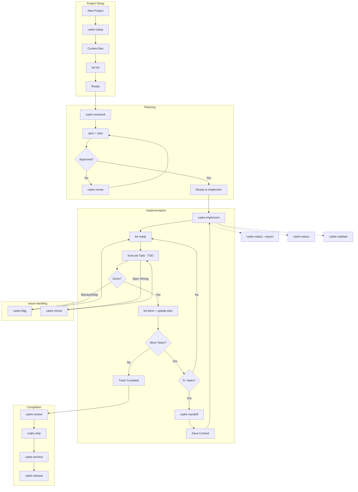
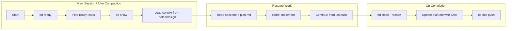
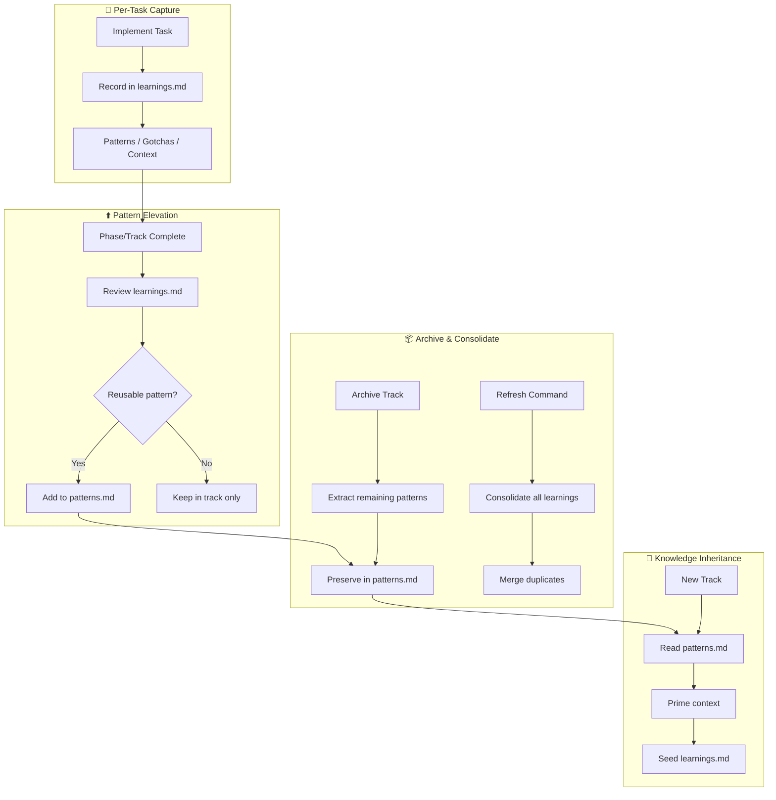

# Cadre

**Measure twice, code once.**

A unified toolkit for **Context-Driven Development** that combines structured planning with persistent memory. Turn your AI assistant into a proactive project manager that follows a strict protocol: **Context → Spec & Plan → Implement**.

**Version:** 1.0.0

## What is Cadre?

Cadre brings together two complementary halves:

- **Spec-first planning** — specs, plans, tracks, and TDD workflows (the Cadre methodology)
- **Beads** — persistent task memory that survives conversation compaction

Together, they enable AI agents to manage long-horizon development tasks without losing context across sessions.

> 📋 Full version history is in the **[Changelog](CHANGELOG.md)**.

## What's New in v1.0.0

### Team-scale workflow

- **An SDLC tail** — once a track is implemented, it flows through **review → ship/land → archive → release**. `/cadre-review` is an **enforced quality gate**: it records its verdict in `metadata.json` (`review.verdict` ∈ `approved` | `changes_requested`, plus `blocking_count`), and `/cadre-ship` (monorepo) and `/cadre-land` (polyrepo) **refuse to proceed** on `changes_requested` or any blocking findings. A missing review prompts you to confirm; a clean approval proceeds.
- **`tracks.md` is now a derived cache** — `metadata.json.status` is the **single source of truth** for a track's status. Never hand-edit the markers in `tracks.md`; rebuild it with `/cadre-status --regen-index`.
- **New status modes** — `/cadre-status` gains `--mine` (your tracks), `--team` (per-person board), `--repos` (polyrepo fleet board), and `--regen-index` (rebuild the index), alongside the existing `--export`.
- **Per-person identity + advisory leases** — assignees now use your git committer identity (`user.email` → `user.name`) rather than a literal `cadre`. `metadata.json` gained `owner`, `reviewer`, `review`, `lease`, and `merge_order`. In **shared** sync mode a track can hold an **advisory lease** (a no-op in monorepo and local modes; stale leases are swept by `/cadre-validate`).
- **Collision-proof track IDs** — same-day duplicate IDs get a short base36 suffix, and a push/Dolt conflict triggers a clean re-suffix (directory, `metadata.track_id`, branch, and Beads epic/label) followed by `--regen-index`.
- **`/cadre-ship` can open the PR** — set `"auto_open": true` in `cadre/config.json` (default `false` = prepare only).
- **Merge train uses merge commits** — squash is **disabled as a guardrail** (a squashed merge has no deterministic commit to pin the submodule gitlink to). Product PRs/MRs merge with a merge commit and the control repo pins the gitlink to it; `/cadre-land` preflight warns and offers to disable squash on product repos. See the [Polyrepo Guide](docs/POLYREPO.md).

## What's New in v0.3.0

### Multi-platform support
- **Four new platforms** — the full 16-command suite now ships for **OpenAI Codex CLI**, **Cursor**, **Google Antigravity**, and **GitHub Copilot**, alongside Claude Code.
- **Single source of truth** — the new [`scripts/generate-commands.sh`](scripts/generate-commands.sh) derives the Codex, Cursor, Antigravity, and Copilot command sets from the canonical Claude Code commands, so all platforms stay in sync. Run `--check` in CI to catch stale output.
- **Per-platform context files** — `AGENTS.md` (Codex + Antigravity), `.github/copilot-instructions.md` (Copilot), and `.cursor/rules/cadre.mdc` (Cursor) join the existing `CLAUDE.md`.
- **New [Install & Version Guide](docs/INSTALL.md)** — a compatibility matrix and per-platform install steps for all five tools, plus the versioning policy.

### Removed
- **Gemini CLI support dropped** — the Gemini extension (`gemini-extension.json`), TOML commands (`commands/cadre/`), and `GEMINI.md` have been removed in favor of **Google Antigravity**, which now covers the Google ecosystem via `.agent/workflows/`.

> All platforms operate on the same `cadre/` and `.beads/` directories, so you can mix tools on one repo (e.g. plan in Cursor, implement in Claude Code).

## What's New in v0.2.0

### Bug Fixes
- **`implement` now works on the track branch** — previously all work happened on `main`. The command now switches to the track worktree before any file operations or commits.
- **`newtrack` creates worktree after scaffold commit** — the track branch is now cut from a commit that already includes spec.md, plan.md, and metadata.json.
- **Flat worker worktree paths** — parallel worker worktrees are now siblings (`.worktrees/<track_id>_worker_<N>_<name>`) instead of nested children (`.worktrees/<track_id>/worker_<N>_<name>`), which git requires.
- **`bd ready --parent` flag** — corrected from `--epic` which does not exist in the Beads CLI.

### New Features
- **`.beads/` merge conflict auto-resolution** — `cadre-setup` now adds `.beads/** merge=ours` to `.gitattributes` so PR merges never conflict on the Dolt database.
- **Archive rebase + PR guidance** — `cadre-archive` now rebases the track branch onto main, resolves `.beads/` conflicts automatically, and guides PR creation instead of auto-merging.
- **Explicit archive commit staging** — archive commits now explicitly stage deleted track files (`git rm -r`) to avoid ghost entries.
- **Dolt state flush in archive** — `bd dolt push` is called before rebasing to ensure no pending Dolt changes are lost.

### Migration from v0.1.0

If you have existing projects set up with v0.1.0, run the migration script from your **project root**:

```bash
# Dry-run first (shows what would change, no writes)
bash /path/to/cadre-beads/scripts/migrate-v2.sh --dry-run

# Apply migration
bash /path/to/cadre-beads/scripts/migrate-v2.sh
```

**What the migration script fixes:**
| Issue | Fix Applied |
|-------|-------------|
| Nested worker worktrees | `git worktree move` to flat paths |
| Missing `.beads/` merge strategy | Adds `.beads/** merge=ours` to `.gitattributes` |
| Stale `parallel_state.json` paths | Updates stored worktree paths via `sed` |
| Track branch missing scaffold files | Warns with exact `git cherry-pick` commands to fix |

See [`scripts/migrate-v2.sh`](scripts/migrate-v2.sh) for full details.

---

## Supported Platforms

| Platform | How | Invoke |
|----------|-----|--------|
| **Claude Code** | slash commands + skills | `/cadre-setup` |
| **OpenAI Codex CLI** | custom prompts | `/cadre-setup` |
| **Cursor** | commands + rule | `/cadre-setup` |
| **Google Antigravity** | workflows | `/cadre-setup` |
| **GitHub Copilot** | prompt files | `/cadre-setup` |
| **Agent Skills compatible CLIs** | skills specification | — |

See the **[Install & Version Guide](docs/INSTALL.md)** for the full compatibility matrix and per-platform setup. Installation summaries are below.

---

## Prerequisites

### Install Beads (Required for persistent memory)

Beads provides persistent, structured memory for coding agents. Install using one of these methods:

```bash
# npm (recommended)
npm install -g @beads/bd

# Homebrew (macOS/Linux)
brew install beads

# Go
go install github.com/steveyegge/beads/cmd/bd@latest
```

Verify installation:
```bash
bd --version
```

> **Note:** Beads integration is always attempted for persistent memory. If the `bd` CLI is unavailable or fails, you'll be prompted to choose whether to continue without it.

---

## Installation

### Quick install (recommended)

Clone the repo and run the installer. It detects which supported CLIs you have,
lets you pick which to set up, and installs them either **globally** (`~/`) or
into a **project** directory:

```bash
git clone https://github.com/vishal-kr-barnwal/Cadre.git
cd Cadre
bash scripts/install.sh
```

```bash
# Non-interactive examples
bash scripts/install.sh --all --global         # every detected tool, globally
bash scripts/install.sh --project=~/my-app claude codex   # selected tools, into a project
bash scripts/install.sh --dry-run              # preview without writing anything
```

Prefer to copy things yourself? The per-platform manual steps are below and in
the [Install & Version Guide](docs/INSTALL.md).

### Claude Code

Clone the repo once, then copy the commands and skills into your config:

```bash
git clone https://github.com/vishal-kr-barnwal/Cadre.git

# Global install (available in every project)
cp -r Cadre/.claude/commands/* ~/.claude/commands/
cp -r Cadre/.claude/skills/*   ~/.claude/skills/
```

To scope the install to a single project instead, copy into that project's `.claude/`:

```bash
cp -r Cadre/.claude/commands your-project/.claude/commands
cp -r Cadre/.claude/skills   your-project/.claude/skills
```

> **Smaller context window?** Copy only the `cadre` skill (`.claude/skills/cadre`) — it already includes Beads integration. Add the `beads` and `skill-creator` skills only if you want standalone Beads usage or to build your own skills.

### OpenAI Codex CLI

Codex loads custom prompts globally from `~/.codex/prompts/`:

```bash
mkdir -p ~/.codex/prompts
cp -r .codex/prompts/* ~/.codex/prompts/
cp AGENTS.md your-project/AGENTS.md   # project context
```

Invoke `/cadre-setup` from the slash menu. Codex expands `$ARGUMENTS`, so `/cadre-newtrack Add OAuth login` works.

### Cursor

```bash
mkdir -p your-project/.cursor/commands your-project/.cursor/rules
cp -r .cursor/commands/* your-project/.cursor/commands/
cp .cursor/rules/cadre.mdc your-project/.cursor/rules/
```

Type `/` in the Agent input and pick `cadre-setup`. The `.mdc` rule loads Cadre conventions automatically.

### Google Antigravity

```bash
mkdir -p your-project/.agent/workflows
cp -r .agent/workflows/* your-project/.agent/workflows/
cp AGENTS.md your-project/AGENTS.md
```

Invoke `/cadre-setup`; Antigravity matches the workflow file name.

### GitHub Copilot

```bash
mkdir -p your-project/.github/prompts
cp -r .github/prompts/* your-project/.github/prompts/
cp .github/copilot-instructions.md your-project/.github/copilot-instructions.md
```

In Copilot Chat, type `/` then `cadre-setup`. Enable prompt files in VS Code with `"chat.promptFiles": true` if needed.

> The Codex, Cursor, Antigravity, and Copilot command sets are generated from the Claude commands by [`scripts/generate-commands.sh`](scripts/generate-commands.sh). See the [Install & Version Guide](docs/INSTALL.md) for details.

---

## Setup Guide

Run the setup command once in your project directory — it does everything:

```bash
/cadre-setup
```

Setup will:

1. Scaffold the `cadre/` directory:
   - `product.md` — product vision and goals
   - `tech-stack.md` — technology choices
   - `workflow.md` — development standards (TDD, commits)
   - `tracks.md` — derived track index (a cache rebuilt from each track's `metadata.json` via `/cadre-status --regen-index`; `metadata.json.status` is the source of truth, so never hand-edit the markers)
2. **Prompt you to choose a Beads mode** and initialize it for you (runs `bd init`, creates `.beads/`, writes `cadre/beads.json`, and configures `.gitattributes` so PR merges never conflict on the Beads database).

You don't need to run `bd init` yourself — setup handles it.

### Beads mode

When prompted, pick the mode that fits your repo:

| Mode | What setup runs | When to use |
|------|-----------------|-------------|
| **Normal** | `bd init` | The whole team uses Beads. `.beads/` is committed to the repo so everyone shares the task graph. |
| **Stealth** | `bd init --stealth` | Personal use on a shared repo. `.beads/` is gitignored and stays local. |

The choice is recorded in `cadre/beads.json` (copied from the bundled
template; setup sets `mode`):

```json
{
  "enabled": true,
  "mode": "normal",
  "memoryStrategy": "beads-primary",
  "epicPrefix": "cadre",
  "autoCreateTasks": true,
  "compactOnPhaseComplete": true,
  "pushOnTaskComplete": false,
  "pushOnPhaseComplete": true,
  "pushOnTrackComplete": true,
  "worktreePerTrack": true,
  "worktreePerWorker": true
}
```

---

## Implementation Guide

### Creating a New Track

```bash
/cadre-newtrack "Add user authentication"
```

This creates:
- `cadre/tracks/<track_id>/spec.md` - Requirements
- `cadre/tracks/<track_id>/plan.md` - Phased task list
- `cadre/tracks/<track_id>/metadata.json` - Track metadata
- Beads epic (if enabled): `bd-xxxx`

### Implementing a Track

```bash
/cadre-implement
```

The workflow:
1. **Load context** - Reads spec.md and plan.md
2. **Find ready tasks** - Uses `bd ready` if Beads enabled
3. **Execute TDD** - Write test → Implement → Refactor
4. **Track progress** - Updates plan.md and Beads status
5. **Verify** - Manual verification at phase boundaries

### Parallel Task Execution (New!)

For phases with independent tasks, Cadre can now execute them in parallel using sub-agents:

```markdown
## Phase 1: Core Setup
<!-- execution: parallel -->

- [ ] Task 1: Create auth module
  <!-- files: src/auth/index.ts, src/auth/index.test.ts -->
  
- [ ] Task 2: Create config module
  <!-- files: src/config/index.ts -->
```

**How it works:**
1. During `/cadre-newtrack`, you'll be asked if you want parallel execution
2. Tasks are analyzed for file conflicts and dependencies
3. During `/cadre-implement`, parallel phases spawn sub-agents
4. Each sub-agent works on exclusive files with TDD workflow
5. Results are aggregated when all workers complete

**Benefits:**
- ⚡ Faster execution for independent tasks
- 🔒 File locking prevents conflicts
- 📊 State tracking via `parallel_state.json`

See [Parallel Execution Design](docs/PARALLEL_EXECUTION.md) for details.

### Checking Status

```bash
/cadre-status
```

Shows:
- Active tracks with progress
- Ready tasks (from Beads)
- Blocked items

Status modes:
- `--mine` — only tracks you own (matched against your git committer identity)
- `--team` — a per-person board across all owners
- `--repos` — a polyrepo fleet board (per-repo PR/merge state)
- `--regen-index` — rebuild the derived `cadre/tracks.md` from each track's `metadata.json` (the source of truth)
- `--export` — write a project summary to disk

---

## Commands Reference

The same command name works on every supported platform (Claude Code, Codex CLI, Cursor, Antigravity, Copilot).

| Command | Description |
|---------|-------------|
| `/cadre-setup` | Initialize project context |
| `/cadre-newtrack` | Create feature/bug track |
| `/cadre-implement` | Execute tasks from plan |
| `/cadre-status` | Show progress overview (`--mine`/`--team`/`--repos` boards, `--regen-index` rebuilds `tracks.md`, `--export` writes a summary) |
| `/cadre-revert` | Git-aware revert |
| `/cadre-validate` | Validate project integrity |
| `/cadre-flag` | Flag a task as blocked or skipped |
| `/cadre-revise` | Update spec/plan |
| `/cadre-review` | Review a track's diff before shipping |
| `/cadre-ship` | Rebase reviewed track, push, prepare PR (monorepo) |
| `/cadre-land` | Polyrepo: open + link cross-repo PR group; merge train lands it |
| `/cadre-archive` | Archive completed tracks |
| `/cadre-release` | Cut a local release (changelog + tag) |
| `/cadre-handoff` | Create context handoff |
| `/cadre-refresh` | Sync context with codebase |
| `/cadre-formula` | Track templates: list/show/create/wisp |

### Essential Beads Commands

> **v1.0.2:** Beads uses embedded Dolt by default. No external server (`bd dolt start`) is required.

| Command | Description |
|---------|-------------|
| `bd prime` | Load AI-optimized workflow context (run first!) |
| `bd ready` | List tasks with no blockers |
| `bd create "Title" -t story -p 0` | Create a P0 story (highest priority) |
| `bd create "Bug" --deps discovered-from:<id>` | Create and link discovered work |
| `bd show <id>` | View task details, notes, and context |
| `bd close <id> --continue` | Complete task and auto-advance to next |
| `bd note <id> "context"` | Add notes for session resume |
| `bd dep add <child> <parent>` | Add dependency between tasks |
| `bd dep relate <id1> <id2>` | Link related issues (bidirectional) |
| `bd dolt push` | Push to Dolt remote (use at session end) |

### Molecule Commands (v0.34+)

| Command | Description |
|---------|-------------|
| `bd formula list` | List available workflow templates |
| `bd mol pour <template>` | Create persistent track from template |
| `bd mol wisp <template>` | Create ephemeral exploration (no audit) |
| `bd mol current` | Show current step in molecule |
| `bd mol squash <id>` | Compress completed molecule to digest |
| `bd mol distill <epic> --as "Name"` | Extract template from completed work |

---

## Skills

Located in `.claude/skills/`:

| Skill | Description |
|-------|-------------|
| **cadre** | Context-driven development methodology. Auto-activates when `cadre/` directory exists. Provides intent mapping for natural language commands. |
| **beads** | Persistent task memory that survives conversation compaction. Auto-activates when `.beads/` directory exists. Integrates with Cadre for cross-session memory. |
| **skill-creator** | Guide for creating and packaging new AI agent skills. |

### How Skills Work

Skills auto-activate based on project structure:
- `cadre/` directory → Cadre skill loads
- `.beads/` directory → Beads skill loads
- Both present → Integrated workflow enabled

Skills provide:
- **Context Loading**: Automatically reads relevant project files
- **Intent Mapping**: Converts natural language to commands
- **Proactive Behaviors**: Suggests next steps and detects issues

---

## Project Structure

### Repository Structure

```
Cadre/
├── .claude/
│   ├── commands/        # Claude Code slash commands (16) — canonical source
│   └── skills/          # Skills (cadre, beads, skill-creator)
├── .codex/prompts/      # OpenAI Codex CLI commands (generated)
├── .cursor/             # Cursor commands + rule (generated)
├── .agent/workflows/    # Google Antigravity workflows (generated)
├── .github/prompts/     # GitHub Copilot prompt files (generated)
├── scripts/             # install.sh, generate-commands.sh, migrate-to-cadre.sh
├── templates/           # Workflow + styleguide templates, ci/ (merge-train + drift-check)
├── docs/                # Documentation (see docs/INSTALL.md)
├── CLAUDE.md            # Claude Code context
└── AGENTS.md            # Codex + Antigravity context
```

### Generated Project Structure

When you run Cadre on a project:

```
your-project/
├── cadre/
│   ├── product.md           # Product vision
│   ├── tech-stack.md        # Technology choices
│   ├── workflow.md          # Development standards
│   ├── tracks.md            # Derived track index (cache; rebuilt from metadata.json via --regen-index)
│   ├── patterns.md          # Consolidated learnings (Ralph-style)
│   ├── beads.json           # Beads integration config
│   ├── HANDOFF.md           # Single rolling handoff (trimmed; --for-teammate writes prose)
│   ├── .gitignore           # Ignores agent-local state (setup/refresh/implement state)
│   ├── repos.json           # Polyrepo only: control-repo topology + submodule map
│   ├── config.json          # Polyrepo only: PR provider, sync mode, auto_open
│   └── tracks/
│       └── <track_id>/
│           ├── spec.md      # Requirements
│           ├── plan.md      # Task list
│           ├── learnings.md # Patterns/gotchas discovered
│           └── metadata.json # Source of truth: status, owner, reviewer, review, lease, merge_order
├── .beads/                  # Beads Dolt DB (if initialized)
├── .gitattributes           # .beads/** merge=ours + parallel_state.json merge=ours (added by setup)
└── .worktrees/              # Git worktrees (flat — no nesting)
    ├── <track_id>/          # Track worktree (branch: track/<track_id>)
    └── <track_id>_worker_0_<name>/  # Parallel worker (branch: track_<id>_worker_0_<name>)
```

---

## Status Markers

Throughout cadre files:
- `[ ]` - Pending/New
- `[~]` - In Progress
- `[x]` - Completed
- `[!]` - Blocked
- `[-]` - Skipped

These markers in `tracks.md` are derived from each track's `metadata.json.status` (the source of truth) — never hand-edit them; rebuild with `/cadre-status --regen-index`.

---

## Workflow Diagrams

### Complete Workflow



### Session Resume Flow (with Beads)



### Quick Reference Patterns

| Pattern | Command Flow |
|---------|--------------|
| **Happy Path** | `setup` → `bd init` → `newtrack` → `implement` → `archive` |
| **Multi-Section** | `implement` → *(5+ tasks)* → `handoff` → *(new session)* → `implement` |
| **Handle Blockers** | `implement` → `block` → `skip` or wait → `implement` |
| **Mid-Track Changes** | `implement` → `revise` → `implement` |
| **Session Resume** | `bd ready` → `bd show --notes` → load spec → `implement` |
| **Monitoring** | `status` / `validate` *(anytime)* |
| **Context Drift** | `refresh` *(when codebase changed outside Cadre)* |

### Knowledge Flywheel (Ralph-style Learnings)

Cadre captures and consolidates learnings across tracks, inspired by [Ralph](https://github.com/snarktank/ralph):



**Key Files:**
- `cadre/patterns.md` - Project-level patterns (read before starting new work)
- `cadre/tracks/<id>/learnings.md` - Per-track discoveries (patterns, gotchas, context)

**How it works:**
1. **Capture** - After each task, learnings are appended to track's `learnings.md`
2. **Elevate** - At phase/track completion, reusable patterns move to `patterns.md`
3. **Archive** - Remaining patterns extracted before archiving
4. **Inherit** - New tracks read `patterns.md` to prime context

**Learnings Entry Format:**
```markdown
## [2025-01-09 14:30] - Phase 1 Task 2: Add auth middleware
Session/thread ref if available
- **Implemented:** JWT validation middleware
- **Files changed:** src/auth/middleware.ts, src/auth/types.ts
- **Commit:** abc1234
- **Learnings:**
  - Patterns: This codebase uses Zod for all validation
  - Gotchas: Must update index.ts barrel exports when adding modules
  - Context: Auth module owns all JWT logic
```

---

## Documentation

- [Manual Workflow Guide](docs/manual-workflow-guide.md)
- [Beads Integration](docs/BEADS_INTEGRATION.md)
- [Parallel Execution](docs/PARALLEL_EXECUTION.md)
- [Beads Official Docs](https://github.com/steveyegge/beads)

---

## License

[Apache License 2.0](LICENSE)
