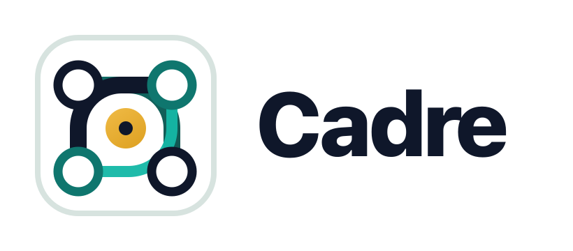

# Cadre Harness Repository

This repository builds and packages the Cadre workflow harness. The Cadre
runtime, protocols, skill shim, templates, and tests live
under [`harness/`](harness/). The public documentation website lives under
[`docs/`](docs/), with Markdown source in [`docs/content/`](docs/content/).

Public docs: [https://cadre-docs.pages.dev/](https://cadre-docs.pages.dev/)

Root files are intentionally thin:

- `AGENTS.md` and `CLAUDE.md` describe how agents should work on this harness.
- `docs/` contains the canonical Next.js/shadcn public documentation site.
- Plugin and marketplace files are install-time artifacts produced by
  `cadre install`, not checked-in source files.
- `LICENSE` and `.gitignore` apply to the whole repository.

Install workspace dependencies from the repository root:

```bash
pnpm install
pnpm check
```

For harness-only development, use `pnpm --filter cadre-ai check`.

Install Cadre from npm and wire supported clients with:

```bash
npm install -g cadre-ai
cadre install
```

Start with the [Cadre documentation](https://cadre-docs.pages.dev/) for
installation, workflow, architecture, team, polyrepo, and troubleshooting
details, or run the docs website locally from `docs/`.
