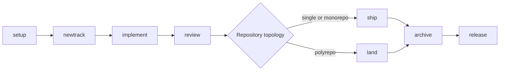

# Capabilities

Cadre is a packet-led coordination runtime for AI-assisted development. It
combines durable project context, spec-first work, review policy, code
intelligence, and publication evidence without asking agents to reconstruct
control-plane state from Markdown.

## Capability Matrix

| Area | Capability | Operational boundary |
|---|---|---|
| Clients | Thin Codex, Claude Code, GitHub Copilot, and Google Antigravity integrations | Clients activate the same packaged MCP runtime; platform shells do not own workflow logic. |
| Project context | Product, workflow, patterns, tech stack, style guides, and project skills | Canonical JSON and packet state are authoritative; Markdown is a projection. |
| Planning | Specs, acceptance criteria, tasks, dependencies, phases, file annotations, and verification | New or revised plans use staged human approval. |
| Durable memory | Tasks, notes, blockers, handoffs, events, messages, journals, and local formula wisps | Cadre packets own writes and derived indexes. |
| Review | Commit-pinned review evidence, test results, diagnostics, manual verification, and policy gates | Ship and land fail closed when configured evidence is missing. |
| Teams | Owners, advisory leases, collision scans, review queues, team boards, and next actions | Leases coordinate work but do not replace Git isolation. |
| Topology | Single repository, monorepo, and polyrepo control repository | Polyrepo operations resolve each product repository explicitly. |
| Parallel work | Dependency-aware phases, worker payloads, file claims, result evidence, and merge-back | Sequential execution remains the default when safety is unclear. |
| Intelligence | Repo maps, dependency graphs, test impact, diagnostics, LSP review, and DAP recommendations | Missing optional language services degrade visibly rather than blocking every workflow. |
| Providers | Local-only mode plus hosted provider evidence for GitHub and GitLab | Hosted evidence comes through provider integrations, not invented CLI fallbacks. |
| Traceability | Product/control commits, native events, journals, and Git notes | Each trace feature is independently configurable. |
| Repository rules | Workflow- and repo-targeted project skills with lazy references | Skills are repository-owned, bounded, and never execute scripts automatically. |

## Supported Workflow Lifecycle

Supporting workflows cover debugging, status, validation, flags, revisions,
handoffs, context refresh, revert, formulas, artifacts, and project-skill
management. See [Workflow Reference](workflow-reference.md) for the complete
contract.

## Supported Operating Models

### Solo And Local-First

Use `sync_mode:"local"` and `provider_mode:"local"` when Cadre state does not
need to move between contributors and hosted pull-request evidence is outside
the workflow. Review and traceability still work locally.

### Shared Repository Team

Use shared sync when the repository's Cadre control plane must move through a
dedicated branch. Configure ownership, review policy, provider evidence, and
trace-note behavior deliberately before enabling automation.

### Polyrepo Product

A control repository owns shared Cadre context and `cadre/repos.json`; product
changes live in the declared repositories. `cadre-land` coordinates the
cross-repository publication plan and provider evidence.

## Safety Properties

- Only explicit human approval advances staged review output.
- Target-path previews are reviewable worktree changes, not silent execution.
- Drift between approved preview content and final execution fails closed.
- Project roots are resolved on every project-scoped call.
- Provider evidence is required only when policy and provider mode require it.
- Required project-skill rules are not silently truncated.
- Parallel work is bounded by dependencies, file claims, worker evidence, and
  merge-back checks.

## What Cadre Does Not Do

Cadre does not replace Git, a hosted code provider, a coding agent, or a test
runner. It coordinates them. It also does not treat generated Markdown as
canonical state, execute arbitrary project-skill scripts, or turn optional MCP
integrations into universal installation requirements.
