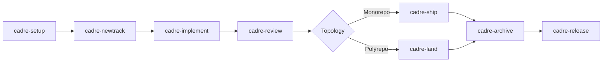

# Cadre


**Measure twice, code once.**

Cadre is a context-driven development harness for AI coding agents. It gives
Claude Code and OpenAI Codex the same packet-owned workflow: structured setup,
spec-first tracks, Beads-backed task memory, review gates, team boards,
parallel worker orchestration, and mono/polyrepo delivery.

Cadre is not a prompt collection that asks agents to edit state by hand. The
installed plugin bundles a Cadre MCP runtime, workflow protocols, templates,
and helper scripts. Agents call Cadre packets, and those packets own Cadre
state, Beads writes, review records, provider evidence, and derived indexes.

## Why Cadre Exists

AI coding sessions often lose context, skip handoff details, or compete over
the same files when a team works in parallel. Cadre makes the workflow durable:

| Need | Cadre answer |
|------|--------------|
| Project context | Canonical product, workflow, pattern, tech-stack, and style-guide artifacts with generated human projections. |
| Work planning | Canonical track specs and plans with testable acceptance criteria, file annotations, and generated review projections. |
| Durable memory | Beads stores the task graph, dependencies, notes, blockers, and handoffs. |
| Team safety | Owners, advisory leases, collision scans, review queues, and shared sync. |
| Code intelligence | Repo maps, dependency graph, test impact, diagnostics, and optional LSP review. |
| Delivery | Review gates, hosted provider evidence, monorepo ship, and polyrepo land. |

## Quick Start

Install Beads:

```bash
npm install -g @beads/bd
bd --version
```

Install the Cadre plugin from this repository.

Claude Code:

```text
/plugin marketplace add vishal-kr-barnwal/Cadre
/plugin install cadre@cadre
```

OpenAI Codex:

```bash
codex plugin marketplace add vishal-kr-barnwal/Cadre --sparse .agents/plugins --sparse harness/plugins/cadre
codex plugin add cadre@cadre
```

In a target project, activate Cadre and run setup:

```text
$cadre
cadre-setup
```

Then use the normal lifecycle:

```text
cadre-newtrack "Add OAuth login"
cadre-implement
cadre-review
cadre-ship
cadre-archive
```

Use `cadre-land` instead of `cadre-ship` when the project is a polyrepo control
repo.

## Workflow Lifecycle



Every project-scoped packet call carries a `root` argument. Cadre MCP resolves
that root, reads the relevant bounded context, performs the requested operation,
and returns structured next actions. Agents summarize packet results; they do
not manually reconstruct Cadre state.

## Documentation Map

- [Getting Started](getting-started.md): install Beads, install the plugin, run
  first setup, and verify the runtime.
- [How Cadre Works](how-cadre-works.md): packet-owned workflows, MCP, Beads,
  tracks, review gates, provider evidence, and code intelligence.
- [Workflows](workflows.md): detailed guide for every `cadre-*` workflow.
- [Architecture](architecture.md): harness package layout, generated plugin
  bundles, source-of-truth files, and development commands.
- [Team And Polyrepo](team-and-polyrepo.md): shared sync, ownership, leases,
  fleet boards, cross-repo PR groups, and merge train behavior.
- [Parallel Execution](parallel-execution.md): plan annotations, worker waves,
  file claims, merge-back, and recovery.
- [Troubleshooting](troubleshooting.md): common install, MCP, Beads, provider,
  LSP, and generated-bundle failures.

## Repository Roles

This repository is the Cadre harness/package repository. The implementation
lives under `harness/`; the public documentation website lives in the root
`docs/` Next.js app, with these Markdown pages under `docs/content/`.

Generated plugin bundles under `harness/.agents/`, `harness/.claude/`, and
`harness/plugins/` are rebuilt from master sources. Do not edit generated
bundles by hand.
