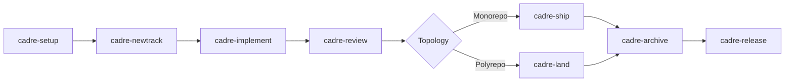

# Cadre


**Measure twice, code once.**

Cadre is a context-driven development harness for AI coding agents. It gives
Claude Code and OpenAI Codex the same packet-owned workflow: structured setup,
spec-first tracks, native task memory, review gates, team boards, parallel
worker orchestration, and mono/polyrepo delivery.

Cadre is not a prompt collection that asks agents to edit state by hand. The
installed plugins are thin MCP entrypoints with `SKILL.md` and client MCP
configuration. The global `cadre-mcp` runtime embeds the skill contract,
workflow protocols, references, template inventory, jobs, and LSP helper modes.
Agents call Cadre packets, and those packets own Cadre state, native event and
message logs, review records, provider evidence, and derived indexes.

## Why Cadre Exists

AI coding sessions often lose context, skip handoff details, or compete over
the same files when a team works in parallel. Cadre makes the workflow durable:

| Need | Cadre answer |
|------|--------------|
| Project context | Canonical product, workflow, pattern, tech-stack, and style-guide artifacts with generated human projections. |
| Work planning | Canonical track specs and plans with testable acceptance criteria, file annotations, and generated review projections. |
| Durable memory | Cadre stores the task graph, dependencies, notes, blockers, handoffs, events, and local wisps. |
| Team safety | Owners, advisory leases, collision scans, review queues, and shared sync. |
| Code intelligence | Repo maps, dependency graph, test impact, diagnostics, and optional LSP review. |
| Delivery | Review gates, hosted provider evidence, monorepo ship, and polyrepo land. |

## Quick Start

Install Cadre and wire detected clients:

```bash
npm install -g cadre-ai
cadre install
```

In a target project, activate Cadre and run setup:

```text
$cadre
cadre-setup
```

Then use the normal lifecycle:

```text
cadre-newtrack "Add OAuth login"
cadre-implement
cadre-review
cadre-ship
cadre-archive
```

Use `cadre-land` instead of `cadre-ship` when the project is a polyrepo control
repo.

## Workflow Lifecycle



Every project-scoped packet call carries a `root` argument. Cadre MCP resolves
that root, reads the relevant bounded context, performs the requested operation,
and returns structured next actions. Agents summarize packet results; they do
not manually reconstruct Cadre state.

## Documentation Map

- [Getting Started](getting-started.md): install the plugin, run
  first setup, and verify the runtime.
- [How Cadre Works](how-cadre-works.md): packet-owned workflows, MCP,
  tracks, review gates, provider evidence, and code intelligence.
- [Workflows](workflows.md): detailed guide for every `cadre-*` workflow.
- [Architecture](architecture.md): harness package layout, thin install-time
  plugins, source-of-truth files, and development commands.
- [Team And Polyrepo](team-and-polyrepo.md): shared sync, ownership, leases,
  fleet boards, cross-repo PR groups, and merge train behavior.
- [Parallel Execution](parallel-execution.md): plan annotations, worker waves,
  file claims, merge-back, and recovery.
- [Troubleshooting](troubleshooting.md): common install, MCP, provider,
  LSP, and plugin-generation failures.
- [Release Notes](release-notes.md): current package changes and upgrade
  notes.

## Repository Roles

This repository is the Cadre harness/package repository. The implementation
lives under `harness/`; the public documentation website lives in the root
`docs/` Next.js app, with these Markdown pages under `docs/content/`.

Plugin bundles are thin install-time entrypoints written by `cadre install`.
Harness-local generated copies under `harness/.agents/`, `harness/.claude/`,
`harness/.claude-plugin/`, and `harness/plugins/` are ignored validation
fixtures, not source files.
