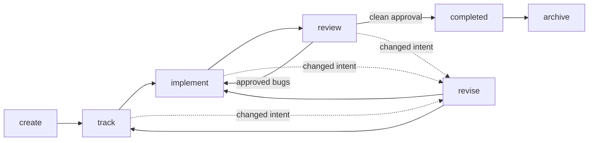

# Cadre

**Measure twice, code once.**

Cadre is a human-governed, Git-aware delivery harness for OpenAI Codex and
Claude Code. It turns approved project context into resumable feature and bug
tracks, carries learning forward between phases, and records implementation
provenance in Git.

Cadre is installed as a user plugin. Its bundled TypeScript MCP server provides
immutable versioned templates and narrow state/Git operations. A target project
keeps only approved mutable delivery state under `.cadre/`; runtime code,
workflow skills, worker definitions, and templates stay in the plugin.

## What Cadre Solves

| Need | Cadre's approach |
|---|---|
| Project context | Human-approved product, engineering, stack, workflow, styleguide, and pattern artifacts. |
| Delivery planning | Feature or bug specifications followed by a validated phase/task dependency DAG. |
| Implementation | Parallel by default when safe, explicitly sequential when requested, with isolated worktrees. |
| Human control | Every artifact and lifecycle transition is presented before mutation. |
| Recovery | Durable setup, operation, and execution journals reconcile files and Git after interruption. |
| Quality | Per-phase and track-level manual verification followed by evidence-backed review. |
| Learning | Dependency-aware phase learning and durable pattern distillation during archive. |

## Lifecycle

```mermaid
flowchart LR
  A["create"] --> B["track"]
  B --> C["implement"]
  C --> D["review"]
  D -->|approved bugs| C
  D -->|clean approval| E["completed"]
  E --> F["archive"]
  B -. changed intent .-> G["revise"]
  C -. changed intent .-> G
  D -. changed intent .-> G
  G --> B
  G --> C
```

`refresh` updates project context, `revert` prepares additive Git reversals,
`status` validates without mutation, and `wisp` explores without entering the
tracked lifecycle.

## Ten Workflow Skills

| Skill | Purpose |
|---|---|
| `create` | Initialize or resume an approved `.cadre/` project. |
| `track` | Specify and plan a feature or bug. |
| `implement` | Execute the approved dependency DAG. |
| `review` | Record approved findings or complete a clean review. |
| `revise` | Change active approved scope or propose a successor. |
| `archive` | Archive completed tracks and distill patterns. |
| `refresh` | Reconcile project context with current evidence. |
| `revert` | Additively reverse a task, phase, or track. |
| `status` | Validate and summarize current project state. |
| `wisp` | Perform lightweight untracked exploration. |

## Start Here

- [Installation](getting-started.md) covers the `cadre-ai` CLI, client
  installation, permissions, update, and uninstall behavior.
- [Quickstart](quickstart.md) walks through the first create-to-archive cycle.
- [How Cadre Works](how-cadre-works.md) explains approval, journals, state, and
  the MCP boundary.
- [Workflows](workflows.md) describes when to use each skill.
- [Parallel Execution](parallel-execution.md) explains workers and worktrees.
- [Complex Parallel Execution Walkthrough](parallel-execution-walkthrough.md)
  follows worker fan-out and phase integration end to end.
- [Troubleshooting](troubleshooting.md) covers common recovery paths.
