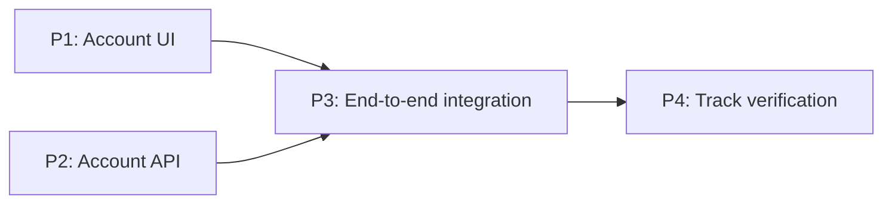

# Complex Parallel Execution Walkthrough

This example follows one track containing independent phases, sequential task
chains, parallel task waves, convergence tasks, and manual-verification
barriers. The execution uses a global maximum of three workers.

Three is used because it is Cadre's conservative generated-workflow default and
matches a host with four total agent slots when one slot is reserved for main.
It is not a harness ceiling: the runtime accepts `1` through `32`, while actual
concurrency remains limited by safe ready work and available host worker slots.

## The Track DAG

The track delivers a UI and API independently, then connects them:



P1 and P2 can run concurrently. P3 cannot start until both are verified and
integrated into the canonical branch. P4 is the derived track-level manual
verification phase.

The tasks inside each delivery phase are:

```text
P1: T1.1 UI foundation
       ├── T1.2 Account form ───────┐
       └── T1.3 Accessibility ──────┴── T1.4 UI integration
                                           └── T1.5 User Manual Verification

P2: T2.1 Schema → T2.2 Endpoint → T2.3 API tests
                                      └── T2.4 User Manual Verification

P3: T3.1 Connect client ────────────┐
    T3.2 Add telemetry ─────────────┴── T3.3 End-to-end tests
                                           └── T3.4 User Manual Verification
```

## Initial Worktrees

Main creates the P1 and P2 integration worktrees from canonical commit `C0`:

```text
.cadre/.worktrees/account-track/run-1/
├── phases/P1    cadre/account-track/run-1/phase-p1 @ C0
└── phases/P2    cadre/account-track/run-1/phase-p2 @ C0
```

These are sibling Git worktrees even though task branches later use a phase
commit as their Git base. Main remains the operational owner of both phase
worktrees.

Because two phases are ready, main assigns:

| Worker | Assignment | Mode |
|---|---|---|
| `phase-ui` | P1, beginning with T1.1 | Sequential phase lease |
| `phase-api` | P2, beginning with T2.1 | Sequential phase lease |
| Third slot | Unused until more work becomes ready | — |

Each worker stops after its current task with an uncommitted diff. Main presents
the evidence, obtains approval, and tells that worker to create only the
approved task commit.

## P1 Changes From Sequential To Fan-out

After T1.1 is approved and committed, the P1 branch is:

```text
C0──A(T1.1)
```

T1.2 and T1.3 are now independently ready. Before creating their workers, main
performs the phase handoff:

1. Confirm T1.1 is recorded with commit `A`.
2. Verify the P1 worktree is clean and resolve its exact HEAD as `A`.
3. Update P1 from `running` to `running` with `workerId: null` and clean-head
   verification.
4. Keep `phase-ui` inactive.
5. Create T1.2 and T1.3 task worktrees from exactly `A`.
6. Record both task-worker assignments before spawning them.

At peak fan-out the layout is:

```text
.cadre/.worktrees/account-track/run-1/
├── phases/P1              phase-p1 @ A
├── phases/P2              phase-p2 @ E(T2.1)
├── tasks/P1--t1-2         task-t1-2 @ A
└── tasks/P1--t1-3         task-t1-3 @ A
```

The three worker slots are now fully used:

| Worker | Concurrent work |
|---|---|
| `task-form` | T1.2 in its task worktree |
| `task-a11y` | T1.3 in its task worktree |
| `phase-api` | T2.2 in the P2 phase worktree |

The inactive `phase-ui` worker is not a scheduler and does not consume or
mutate P1 while its task workers run.

## Approval And Fan-in

Suppose T1.3 finishes first. It remains uncommitted until approval while T1.2
and P2 continue. After approval, `task-a11y` creates commit `C`. T1.2 later
creates approved commit `B`.

Both task commits descend from `A`:

```text
             B(T1.2)
            /
C0──A(T1.1)
            \
             C(T1.3)
```

Main previews and applies their merges into the clean P1 integration worktree,
one at a time:

```text
C0──A──M-B──M-C
```

Implementation was parallel; mutation of the shared phase branch is
serialized. If the second merge conflicts with the first, main records the
conflict, reads both sides, resolves it in the P1 worktree, reruns combined
checks, and presents the resolution before recording the merge commit.

Each task worktree is removed only after its task node is integrated and branch
ancestry proves the approved commit is present in P1.

## The Next Dependency Wave

T1.4 becomes ready only after T1.2 and T1.3 are completed, which means their
approved commits are integrated—not merely implemented. T1.4 therefore starts
from `M-C`, the updated P1 HEAD.

Because T1.4 is the only ready P1 task, main executes it directly in the phase
worktree. A new phase worker could instead be assigned after all task workers
are completed and cleaned up, but delegation would provide little benefit here.

After T1.4 and the P1 manual barrier are approved, P1 merges into canonical.
P2 continues its sequential task chain independently and later merges into the
new canonical HEAD. Since P1 and P2 originally branched from the same `C0`, the
second phase merge can conflict; phase conflicts are resolved and reverified in
the canonical worktree by main.

## P3 Starts From Integrated Dependencies

P3 does not branch from either P1 or P2 directly. It starts only after both
phase nodes are complete and therefore branches from canonical containing both
approved phase integrations:

```text
C0──Merge(P1)──Merge(P2)──P3-base
```

T3.1 and T3.2 have no dependency on each other, so main creates their task
worktrees from the same `P3-base`. After both approved branches merge into P3,
T3.3 starts from the updated P3 HEAD. P3 then passes its manual barrier and
integrates into canonical before track-level verification begins.

## Journal Evidence During The Handoff

The execution journal distinguishes an active lease from historical worker
identity. During P1 fan-out its relevant state resembles:

| Node | Status | Active `workerId` | `workerHistory` |
|---|---|---|---|
| P1 | `running` | `null` | `phase-ui` |
| T1.1 | `completed` | — | — |
| T1.2 | `running` | `task-form` | `task-form` |
| T1.3 | `running` | `task-a11y` | `task-a11y` |

Cadre rejects assigning another P1 phase worker while either task worker is
active. After T1.2 and T1.3 are completed, P1 may acquire another phase-worker
lease; its new identity is appended to `workerHistory` instead of erasing the
earlier assignment.

## Worker Allocation Summary

The scheduler continuously recomputes one global ready queue:

| Checkpoint | Ready work | Allocation |
|---|---|---|
| Track start | P1 and P2 | Two sequential phase workers |
| T1.1 integrated | T1.2, T1.3, and P2 chain | Two P1 task workers plus one P2 phase worker |
| P1 fan-in | T1.4 and P2 chain | Main handles T1.4; P2 worker continues |
| P1 and P2 complete | T3.1 and T3.2 | Two P3 task workers |
| P3 fan-in | T3.3 | Main executes one ready task |
| P3 complete | Track manual verification | Main only, against canonical |

The worker bound applies across the track, not separately to each phase. Main
prioritizes work on the critical path, then work that unlocks the most downstream
nodes, and finally plan order.

## Recovery Example

If execution stops after T1.2 is committed but before its merge, the next run
reconciles:

- the T1.2 journal status and worker identity;
- the task worktree registration and branch tip;
- approved commit `B`;
- the current P1 branch and whether `B` is already reachable.

It resumes at integration rather than rerunning T1.2. If the journal claims the
phase worker was released but the P1 worktree is dirty or has an unexpected
HEAD, Cadre stops and presents the mismatch instead of spawning task workers
from an uncertain base.

## Invariants Preserved

- Main creates every worker and worktree.
- Main owns the global worker limit and execution journal.
- A phase has one mutating execution mode at a time.
- Mode changes happen only at clean committed checkpoints.
- Workers never spawn workers or merge branches.
- Parallel task workers in one wave share one recorded phase base.
- Downstream waves begin only after dependency commits are integrated.
- Every regular task retains its own approval and Conventional Commit.
- Phase and track manual-verification barriers remain explicit.
