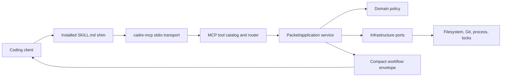

# Runtime & MCP

Cadre exposes a small public MCP surface while keeping workflow behavior in
typed application and domain modules. Contributors should trace a request from
the public contract inward rather than starting in generated JavaScript.

## Request Path

The installed shim activates Cadre and states invariants. It does not embed the
workflow engine. `cadre-mcp` serves three public tools, the resource registry,
and the packaged setup templates needed at runtime. Source skill metadata,
workflow protocols, and maintainer references are not exposed as MCP resources.

## Public Tool Boundary

- `cadre_workflow` starts or continues a named workflow and returns one current
  decision plus at most one deterministic next call.
- `cadre_action` executes a namespaced action returned by a packet.
- `cadre_read` reads one targeted resource URI returned by a packet.

This boundary replaced a larger direct-tool surface with token-efficient v1
contracts. Retired flat packet names are not routing aliases. Public requests
remain nested as `{root, workflow, input, execute, approval}` or
`{root, action, input, execute}`. Add new behavior behind an action, workflow,
or resource before considering another public tool.

A workflow response has at most one immediate single-agent continuation. If
`next` is non-null, clients invoke exactly `next.tool` with `next.arguments`
once for that packet. The only typed callbacks outside `next` are
`decision.required.write_back` after external provider evidence is collected,
each `data.workers[].dispatch.record_finish_packet` in a parallel fan-out, and
exact completion or recovery callbacks reissued under
`data.worker_callbacks[].record_finish_packet`.
Clients do not recover any other action from prose or internal fields.

## MCP Layers

The MCP implementation follows four layers:

| Layer | Responsibility |
|---|---|
| Presentation | Stdio transport, protocol framing, and server startup. |
| Application | Packet handlers, workflow envelopes, review support, jobs, and resources. |
| Domain | Tool/resource definitions and protocol types without filesystem effects. |
| Infrastructure | Root resolution, job process management, and LSP daemon access. |

Normalize untrusted MCP input at the boundary. Application and domain code
should receive explicit types rather than broad JSON bags.

The stdio lifecycle supports MCP `2025-11-25` and `2025-06-18`. Normal requests
follow `initialize`, the negotiated-version response, and
`notifications/initialized`. Malformed JSON and invalid JSON-RPC requests are
reported with the standard parse and invalid-request errors.

## Root Resolution

Every project-scoped call carries a root candidate. The runtime resolves it to
the active Cadre control repository. Setup-safe reads accept an uninitialized
candidate, but other project calls must not guess across unrelated repositories.

Polyrepo operations resolve product repositories only through declared topology
and packet context. Never use process working directory as an implicit product
repository selection when a resolved root is available.

## Workflow Envelopes

The core v1 workflow packet adapter compacts rich internal results once into a
stable response:

- `ok`, `workflow`, `phase`, and `decision`;
- required input or evidence names;
- one immediate single-agent `next` tool call when deterministic progress is possible;
- bounded `artifacts` and relevant resource URIs;
- workflow-specific summaries under `data`;
- `warnings` and structured `errors`.

Do not re-expand large internal payloads into every response. Prefer a compact
summary and a targeted resource.

## Resources

Resources separate discoverable evidence from the hot workflow response.
One typed registry owns definitions and query contracts. `resources/list`
contains fixed resources; `resources/templates/list` contains parameterized
templates. The application resource service validates every URI against that
registry and delegates to typed runtime capabilities. Packaged skill contracts,
workflow protocols, and agent references are deliberately absent from the
runtime resource surface.

When adding a resource:

1. Define its URI, description, and required query contract.
2. Normalize query input at the MCP boundary.
3. Delegate to application/domain behavior.
4. Return bounded JSON with explicit warnings and errors.
5. Add catalog, routing, packet-only, and regression tests.

## Generated Runtime

TypeScript in `harness/src/` is the master source. The JavaScript files under
`harness/scripts/` are build outputs included in the npm package. Always edit
TypeScript first, run the runtime build, and review generated changes together
with their source.
