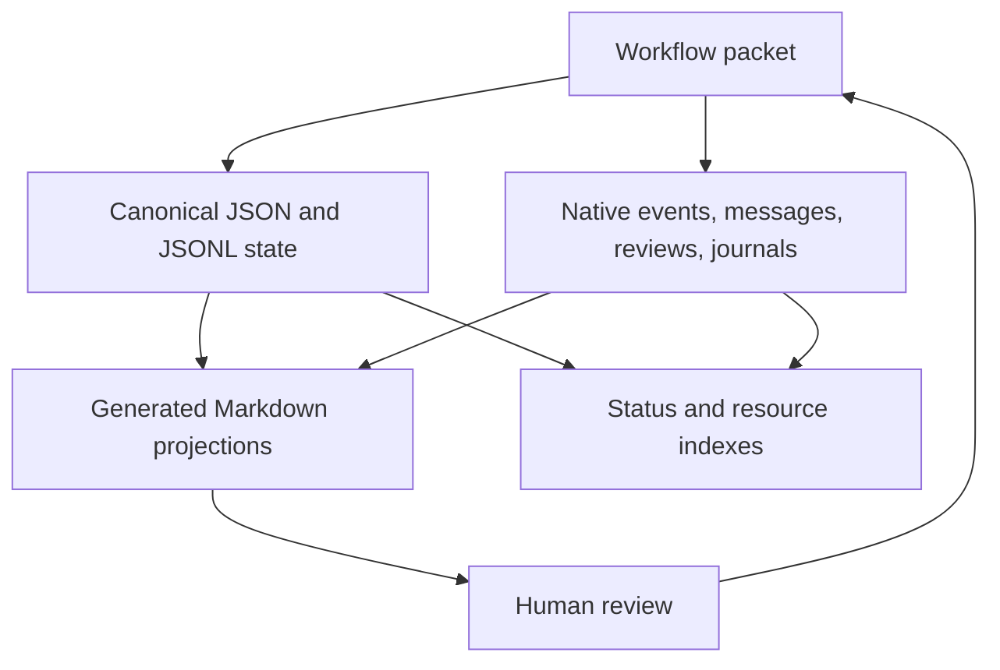

# State & Artifacts

Cadre separates canonical machine state from reviewable human projections.
Contributors must preserve that ownership boundary in every workflow.

## Ownership Model

Markdown projections are review surfaces, not canonical workflow input. When a
projection is stale, regenerate it from canonical state through a Cadre packet.

## Canonical Project Context

Setup owns product, workflow, patterns, tech stack, style-guide selections,
configuration, and topology. Tracks add canonical specs and plans. Project
skills add validated repository-owned rule manifests and optional human
projections.

Schemas should be versioned and explicit. Normalize legacy aliases or untrusted
JSON at the infrastructure boundary, then use narrow application/domain types.

## Native Work State

Native state records:

- task graph, dependencies, status, notes, blockers, and ownership;
- events and messages used by status and team views;
- handoffs and review queue state;
- formula definitions and ignored local wisp runs;
- parallel workers, claims, results, and merge-back progress;
- publication and provider evidence.

Derived views may be rebuilt; canonical events and records must not be replaced
with a hand-written summary.

## Review And Release Artifacts

Specs, plans, reviews, handoffs, refreshes, artifact sync, and releases can use
staged target previews. Approval sessions retain per-stage hashes so final
execution can detect regenerated or on-disk drift.

Release artifacts in target projects are distinct from this harness
repository's npm/GitHub release process.

## Traceability

Cadre connects task completion to product commits, control commits, journals,
events, review records, and optional Git notes. The notes ref defaults to
`refs/notes/cadre`. Treat note pushing and automatic commits as repository
policy, not universal behavior.

## Locks And Concurrency

Infrastructure locking protects packet-owned operations from concurrent writes.
Do not delete lock files as generic recovery. First determine whether the
owning operation is active, stale, or failed and use the returned lock stage and
recovery evidence.

Parallel worker file claims are advisory coordination evidence. They complement
worktrees and Git isolation; they do not make overlapping edits safe.

## Artifact Extension Checklist

When adding a canonical artifact:

1. Define a versioned schema and typed normalized representation.
2. Place read/write behavior behind infrastructure boundaries.
3. Provide a deterministic projection when humans need to review it.
4. Add catalog, preview, sync, drift, and malformed-input tests.
5. Decide whether it belongs in setup, tracks, releases, or project skills.
6. Document which surface is canonical and which is generated.
