# Testing & Release

Cadre releases combine a TypeScript runtime, generated JavaScript, packaged
assets, native client installers, and public documentation. A passing unit test
alone is not a release signal.

## Test Layers

| Layer | Purpose |
|---|---|
| Typecheck | Preserve strict TypeScript contracts across runtime and MCP boundaries. |
| Architecture | Enforce source ownership, generated boundaries, and file-size rules. |
| Runtime | Build JavaScript from TypeScript and detect generated drift. |
| Packet tests | Exercise workflow decisions, actions, resources, approvals, and mutations. |
| Contract tests | Keep the three-tool surface packet-only and token efficient. |
| Client tests | Validate generated plugin shells, marketplaces, approvals, install, and uninstall. |
| Simulation | Exercise team-scale ownership, workers, reviews, and state transitions. |
| Docs checks | Validate content coverage, links, metadata, type safety, static export, and responsive behavior. |

## Targeted Development Loop

Run the narrowest relevant test first, for example:

```bash
pnpm --filter cadre-ai exec node --test scripts/cadre-skill.test.js
pnpm --filter cadre-ai exec node --test scripts/mcp/cadre-server.test.js
pnpm --filter cadre-docs check:content
```

Then run the full harness check:

```bash
pnpm --filter cadre-ai check
```

Before handoff or release, run the workspace check:

```bash
pnpm check
```

## Generated Output Validation

The harness check typechecks sources, builds runtime JavaScript, verifies
generated plugin fixtures, runs tests, and executes the team-scale simulation.
Review generated diffs after the build; an unexpected large bundle change often
reveals a source boundary or packaging mistake.

## Native Installer Release Gate

Before creating or publishing a release, validate the local build against both
native clients:

```bash
pnpm --filter cadre-ai build
node harness/scripts/cadre-cli.js install --target all --scope user
node harness/scripts/cadre-cli.js install --target all --scope user --check
codex plugin list | rg -A3 -B2 'Marketplace `cadre`|cadre@cadre'
claude plugin list --json
```

Both clients must show the candidate `cadre@cadre` version installed and
enabled. Generated MCP configuration must point to
`harness/scripts/mcp/cadre-server.js`. Stop the release if either client or
installer check fails.

## Release Pipeline

```mermaid
flowchart LR
  A["Version and release notes"] --> B["Harness and docs checks"]
  B --> C["Pack dry run"]
  C --> D["Native client install checks"]
  D --> E["Release commit"]
  E --> F["Signed release tag"]
  F --> G["GitHub release publication"]
  G --> H["Trusted npm publish"]
  H --> I["Docs build and deploy"]
```



Local preparation stops after the signed tag. Publishing a GitHub release is a
separate explicit action that triggers npm Trusted Publishing and the docs
pipeline.

## Version Policy

- Major: breaking layout, workflow behavior, public contract, or native-state
  schema changes that require coordinated migration.
- Minor: new workflows, supported clients, capabilities, or opt-in behavior.
- Patch: compatible fixes and documentation corrections.

Use tags named `release-X.Y.Z` and annotated messages named `Release - X.Y.Z`.
Keep `harness/CHANGELOG.md`, package metadata, and public release notes aligned.

## Release Review Checklist

- Compare the candidate against the previous release tag.
- Document additions, behavior changes, fixes, migration, and known cautions.
- Confirm package contents with a pack dry run.
- Verify a clean worktree after generated builds.
- Verify the signed tag points to the intended release commit.
- Do not push, publish, or deploy as an implied side effect of local tagging.
