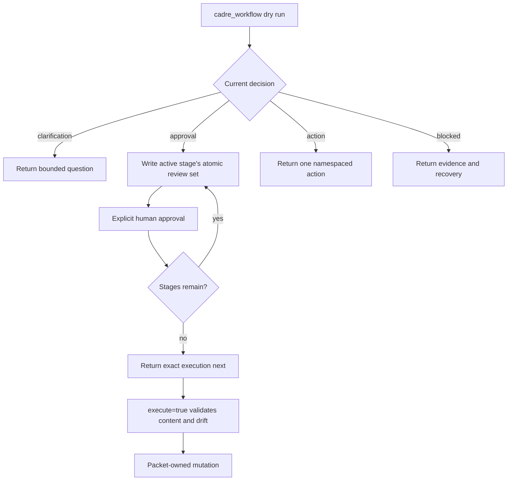

# Workflow Engine

The workflow engine turns an intent into a sequence of bounded packet
decisions. A workflow never asks an agent to infer hidden state transitions or
manually reproduce Cadre mutations.

## Packet Lifecycle

The same workflow entry point supports preview, staged review, and execution.
Only explicit user approval may be mapped into the approval field.

## Decision Types

Common decisions include clarification, approval, action, completion, and
blocked states such as schema validation, provider evidence, ownership
conflict, or staged-review drift. Callers should branch on the structured
decision and stage rather than parsing prose.

## Staged Approval

Review-heavy workflows freeze and materialize only the active stage's
deterministic files. Later stages remain pending and unmaterialized until the
active stage is explicitly approved. In default target mode, each canonical
file and projection, or every file in a grouped stage, is written atomically to
its intended repository path; new files use Git intent-to-add so ordinary
`git diff` includes their content. Bundle mode remains available for a
non-mutating temporary review directory.

The setup ledger is `product` → `product_guidelines` → grouped `technical`
(tech stack, style guides, repository topology, and LSP, informed by the
selected infrastructure choices) → `workflow`. New-track and revision ledgers
are spec → plan when both stages are in scope.

Refresh has a separate analysis-first ledger. Its first call is read-only; the
user then explicitly selects levels, and Cadre materializes only the selected
semantic stages in `product` → `product_guidelines` → `topology` when selected
→ grouped `technical` (tech stack, style guides, and LSP) → `workflow` →
`patterns` order. Diagnostics is exclusive and read-only. Projection repair is
execution-authorized rather than content-approved and is scoped to project and
style-guide generated projections.

For clarification, the client fills only `decision.writable_paths` in the full
returned `decision.resume`. For an explicit active-stage edit it uses
`decision.amend` the same way. Their session-only approval state does not
approve. After explicit user approval, the client sends the exact
`decision.stage`, `decision.stage_hash`, and `decision.stage_revision` plus the
next cumulative `approved_stages` prefix. Do not substitute a clarification's
`decision.current_stage` or reuse a stamp after the stage changes. Once a session exists,
clarification and reference-formatting continuations use the returned
`decision.resume`, keeping one session alive across the stage. Cadre returns an
execution continuation only after the full stage order is approved, and clients
invoke only that exact `next` call.

Final execution validates the frozen snapshot against the on-disk target.
Canonical/projection drift fails closed and never opens a projection-only stage.
An explicit user amendment is authoritative over inference and stale candidate
fields. If it changes the current stage's file membership, Cadre rebases that
stage in the same session, retains the cumulative approved prefix, removes only
unchanged obsolete previews, and returns a new revision and hash. A changed
review file blocks the rebase instead of being overwritten.

## Project-Skill Loading

Before workflow-specific drafting or execution, the engine selects applicable
repository skills by workflow, optional repo target, and explicit `skillIds`.
It returns bounded inline instructions and lazy reference URIs. Blocking skill
validation or required-rule overflow stops the workflow at the project-skills
stage.

## Actions And Mutations

Use an action when a workflow packet has determined the exact next operation
but the operation has a distinct typed input or asynchronous lifecycle. Action
names are capability-scoped, such as task, job, review, artifact, parallel, or
workspace intelligence operations.

Filesystem, Git, process, locking, and provider effects belong behind
infrastructure ports. Domain policy must remain pure.

## Failure Model

Failures should be structured, bounded, and recoverable:

- use a precise stage and reason;
- include warnings separately from errors;
- return the smallest resource needed to inspect evidence;
- avoid returning a next mutation when prerequisites are unmet;
- preserve idempotency where retry is expected;
- fail closed for approval drift, review gates, and ambiguous repository scope.

## Add Or Change A Workflow

1. Update the master workflow list and protocol under
   `harness/skills/cadre/protocols/`.
2. Add or split application behavior in the appropriate bounded capability.
3. Keep domain policy pure and infrastructure effects behind ports.
4. Define compact response fields and any targeted resources.
5. Integrate project-skill selection where the workflow consumes repository
   rules.
6. Add packet, staged-approval, mutation, failure, and token-efficiency tests.
7. Build generated runtime JavaScript and validate generated plugin fixtures.
8. Update user and contributor references in the public docs.

Do not add workflow logic to the installed skill shim or generated JavaScript.
