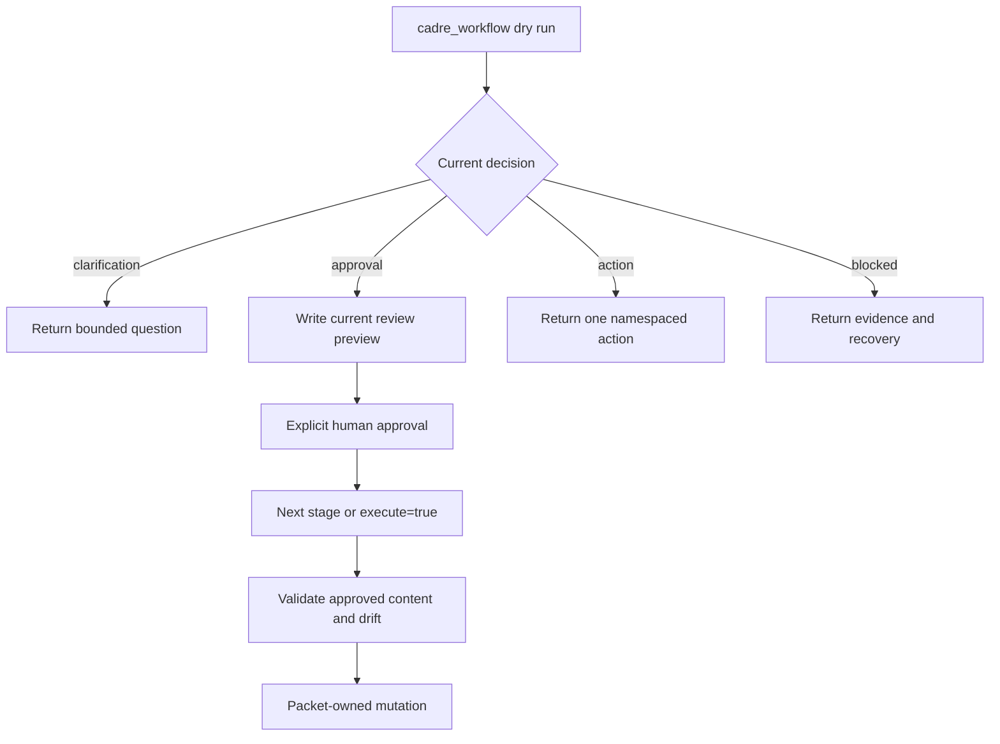

# Workflow Engine

The workflow engine turns an intent into a sequence of bounded packet
decisions. A workflow never asks an agent to infer hidden state transitions or
manually reproduce Cadre mutations.

## Packet Lifecycle

The same workflow entry point supports preview, staged review, and execution.
Only explicit user approval may be mapped into the approval field.

## Decision Types

Common decisions include clarification, approval, action, completion, and
blocked states such as schema validation, provider evidence, ownership
conflict, or staged-review drift. Callers should branch on the structured
decision and stage rather than parsing prose.

## Staged Approval

Review-heavy workflows materialize only the current approval stage. In default
target mode, the preview is written to its intended repository path and appears
in ordinary `git diff` output. Bundle mode remains available for a non-mutating
temporary review directory.

Final execution regenerates expected content and validates it against the
approved preview and on-disk target. Drift fails closed.

## Project-Skill Loading

Before workflow-specific drafting or execution, the engine selects applicable
repository skills by workflow, optional repo target, and explicit `skillIds`.
It returns bounded inline instructions and lazy reference URIs. Blocking skill
validation or required-rule overflow stops the workflow at the project-skills
stage.

## Actions And Mutations

Use an action when a workflow packet has determined the exact next operation
but the operation has a distinct typed input or asynchronous lifecycle. Action
names are capability-scoped, such as task, job, review, artifact, parallel, or
workspace intelligence operations.

Filesystem, Git, process, locking, and provider effects belong behind
infrastructure ports. Domain policy must remain pure.

## Failure Model

Failures should be structured, bounded, and recoverable:

- use a precise stage and reason;
- include warnings separately from errors;
- return the smallest resource needed to inspect evidence;
- avoid returning a next mutation when prerequisites are unmet;
- preserve idempotency where retry is expected;
- fail closed for approval drift, review gates, and ambiguous repository scope.

## Add Or Change A Workflow

1. Update the master workflow list and protocol under
   `harness/skills/cadre/protocols/`.
2. Add or split application behavior in the appropriate bounded capability.
3. Keep domain policy pure and infrastructure effects behind ports.
4. Define compact response fields and any targeted resources.
5. Integrate project-skill selection where the workflow consumes repository
   rules.
6. Add packet, staged-approval, mutation, failure, and token-efficiency tests.
7. Build generated runtime JavaScript and validate generated plugin fixtures.
8. Update user and contributor references in the public docs.

Do not add workflow logic to the installed skill shim or generated JavaScript.
