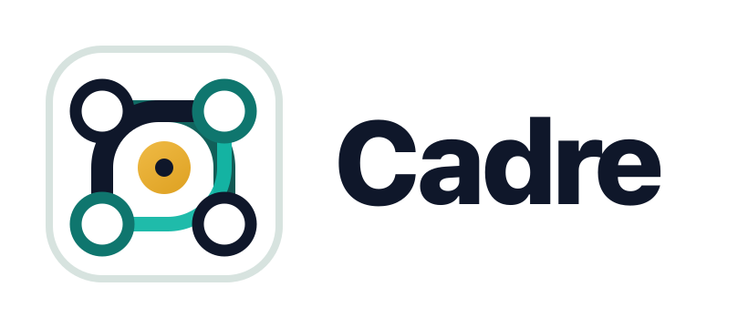

# Cadre



**Measure twice, code once.**

Cadre is a context-driven development harness for AI coding agents. It combines
spec-first tracks, native durable task memory, review gates, team boards,
parallel worker orchestration, and mono/polyrepo delivery into one packet-owned
workflow.

Public docs: [https://cadre-docs.pages.dev/](https://cadre-docs.pages.dev/)

## What Cadre Provides

- **Structured work:** setup, new track, implementation, review, ship/land,
  archive, release, handoff, refresh, revise, validate, flag, and formula flows.
- **Persistent memory:** Cadre stores task graph state, dependencies, notes,
  handoffs, events, and resume evidence through native packet-owned files.
- **Team safety:** ownership, advisory leases, collision scans, review queues,
  shared sync, and compact MCP dashboard resources.
- **Polyglot intelligence:** repo maps, dependency graphs, test impact,
  workspace diagnostics, LSP setup, warm LSP review, and async job artifacts.
- **Four agent surfaces:** Claude Code, OpenAI Codex, GitHub Copilot, and
  Google Antigravity plugins are thin MCP entrypoints. The global `cadre-mcp`
  runtime owns three public packet tools, the validated resource registry, and
  the setup templates needed at runtime.
- **Codex workflow picker:** explicit `$cadre:*` entries make every
  registered workflow discoverable without adding MCP tools.

## Install

Install Cadre from npm and let the CLI wire detected clients:

```bash
npm install -g cadre-ai
cadre install
cadre doctor
```

## Use

In Codex, type `$cadre:` and choose the workflow you need:

```text
$cadre:setup
$cadre:newtrack Add OAuth login
$cadre:implement
$cadre:review
$cadre:ship
```

Codex exposes only these workflow entries, without a redundant
`$cadre:cadre` option. Other supported clients retain the single Cadre skill
and accept the same `cadre-*` workflow names as requests.

Cadre workflows are packet-owned. The agent verifies Cadre MCP, passes a
per-call `root`, and lets the runtime perform state reads/writes, formula work,
parallel worker state, provider evidence write-back, and shared sync. Do not
maintain Cadre state by hand.

## Setup Outputs

`cadre-setup` writes the project control plane:

- `cadre/product.json` plus generated `cadre/product.md`
- `cadre/product_guidelines.json` plus generated `cadre/product_guidelines.md`
- `cadre/tech-stack.json` plus generated `cadre/tech-stack.md`
- `cadre/workflow.json` plus generated `cadre/workflow.md`
- `cadre/tracks.json` as the generated track index
- `cadre/patterns.jsonl` plus generated `cadre/patterns.md`
- `cadre/config.json`
- `cadre/events.jsonl`
- `cadre/messages/outbox.jsonl` and `cadre/messages/inbox.jsonl`
- `cadre/formulas/*.json` when formulas are added
- git-ignored `cadre/local/wisps/*.json` for local ephemeral formula runs
- `cadre/styleguides/index.json` plus generated `cadre/styleguides/README.md`
- `cadre/styleguides/<id>.json` plus generated `cadre/styleguides/<id>.md`
- optional `cadre/repos.json` plus generated `cadre/repos.md` for polyrepo topology
- optional `cadre/lsp.json` for LSP recommendations
- repository-authored `cadre/skills/<skill-id>/skill.json` rule manifests with generated `SKILL.md` human projections

Setup also initializes native Cadre state, can configure shared-sync merge
attributes, and can scaffold hosted CI checks when requested.

## Team And Repo Modes

Cadre supports monorepos and polyrepo control repos. For teams, use shared sync
so ownership, leases, review state, blockers, and available work are visible to
everyone. Product code publication still happens through ship/land workflows;
shared sync is for the Cadre control plane.

Project skills are local to the active repository. Maintainers add them through
normal reviewed Git changes; Cadre selects them by workflow and optional
polyrepo `repos` targeting, returns bounded instructions in workflow packets,
and exposes references lazily through MCP resources. Project skills never fall
back to a global catalog and never execute scripts automatically.

Compact MCP resources provide bounded views for larger teams:

- team board and next actions
- review queue and handoff inbox
- quality gate and parallel worker state
- repo topology, repo map, workspace diagnostics, test impact, and LSP status
- provider action plans and async job results

## Harness Development

This repository is the Cadre harness/package repo. Runtime sources live in
`src/`, master skill/protocol sources live in `skills/cadre/`, references live
in `scripts/agent-refs/`, and templates live in `templates/`.

Run package commands from the repository root:

```bash
pnpm --filter cadre-ai generate
pnpm --filter cadre-ai check
```

Generated plugin bundles under `.agents/`, `.claude/`, and `plugins/` are
rebuilt from master sources. They contain platform manifests, MCP config, and
thin skill shims; the Codex fixture also contains explicit-only generated
workflow-picker skills. The embedded MCP runtime is built under `scripts/`.

Public documentation lives in the repo-root `docs/` Next.js app. Markdown page
source is in `docs/content/`:

- [Documentation Home](../docs/content/overview.md)
- [Getting Started](../docs/content/getting-started.md)
- [How Cadre Works](../docs/content/how-cadre-works.md)
- [Workflows](../docs/content/workflows.md)
- [Architecture](../docs/content/architecture.md)
- [Team And Polyrepo](../docs/content/team-and-polyrepo.md)
- [Parallel Execution](../docs/content/parallel-execution.md)
- [Troubleshooting](../docs/content/troubleshooting.md)
