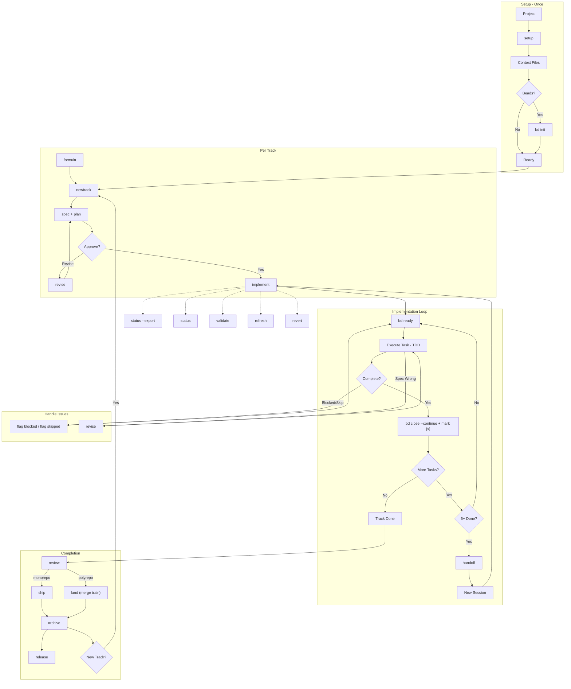

# Workflow Protocol Guide

This guide explains how to drive Cadre through the `$cadre` skill while keeping
precise control over the underlying workflow protocol. Use it when you want the
step-by-step behavior for a workflow such as `cadre-setup`,
`cadre-newtrack`, or `cadre-implement`.

## Workflow Overview



### Quick Reference

| Workflow | Sequence |
|----------|----------|
| **Standard** | `setup` → `bd init` → `newtrack` → `implement` → `review` → `ship` (or `land`) → `archive` → `release` |
| **Multi-Section** | `implement` → `handoff` → *(new session)* → `implement` |
| **Parallel Tasks** | `newtrack` (enable parallel) → `implement` (spawns workers) |
| **Session Resume** | `bd ready` → `bd show --long` → `implement` |
| **Blocked Task** | `flag blocked` → `flag skipped` or wait → continue |
| **Plan Changes** | `revise` → continue `implement` |
| **Undo Work** | `revert` (track / phase / task) |
| **Check Status** | `status` or `validate` anytime |
| **Sync Context** | `refresh` when codebase drifts |
| **Templates** | `formula list` → `formula wisp` or `bd mol pour` |
| **Create Template** | complete track → `formula create` → `formula show` |

## Why Use This Guide?

Skill-routed workflows keep Claude and Codex on the same protocol source while
still letting you inspect each step, state file, and verification point.

## Prerequisites

Before using any Cadre workflow, ensure:
1. Git is installed and initialized in your project
2. You have write access to the project directory
3. For implementation: `cadre/` directory exists with required files
4. Beads CLI (`bd`) installed for persistent memory. Cadre requires Beads during
   setup and halts if it is unavailable.

### Installing Beads

```bash
# npm (recommended)
npm install -g @beads/bd

# Homebrew (macOS/Linux)
brew install steveyegge/beads/bd

# Go
go install github.com/steveyegge/beads/cmd/bd@latest

# Verify
bd --version
```

---

## Cadre Workflows

### 1. `cadre-setup`

**Purpose**: Initialize a new project with Cadre methodology.

**When to use**: First time setting up Cadre in any project.

**Manual workflow**:

```
Step 1: Ask the Cadre skill for the workflow
   cadre-setup

Step 2: Answer project type questions
   - Brownfield (existing code) vs Greenfield (new project)
   - If brownfield: approve codebase scan

Step 3: Complete each section (max 5 questions each)
   a) Product Guide → creates product.md
   b) Product Guidelines → creates product-guidelines.md
   c) Tech Stack → creates tech-stack.json
   d) Code Styleguides → copies to code_styleguides/
   e) Workflow → creates workflow.md

Step 4: Beads Integration (if bd CLI detected)
   - Full Beads integration is enabled by default
   - Creates cadre/beads.json if enabled
   - Runs bd init --non-interactive --role maintainer

Step 5: Create initial track
   - Approve track proposal
   - Review generated spec.md and plan.md

Step 6: Verify artifacts
   cadre/
   ├── setup_state.json
   ├── product.md
   ├── product-guidelines.md
   ├── tech-stack.json
   ├── workflow.md
   ├── tracks.md
   ├── beads.json          # If Beads enabled
   └── tracks/<track_id>/
       ├── metadata.json
       ├── spec.md
       └── plan.md
   .beads/                  # If Beads enabled
```

**State file**: `cadre/setup_state.json`
- Resume from any step if interrupted
- Check `last_successful_step` to see progress

**Beads config**: `cadre/beads.json` (copied from the bundled template;
setup sets `mode`)
```json
{
  "enabled": true,
  "mode": "normal",
  "memoryStrategy": "beads-primary",
  "epicPrefix": "cadre",
  "autoCreateTasks": true,
  "compactOnPhaseComplete": true,
  "pushOnTaskComplete": false,
  "pushOnPhaseComplete": true,
  "pushOnTrackComplete": true,
  "worktreePerTrack": true,
  "worktreePerWorker": true
}
```

---

### 2. `cadre-newtrack`

**Purpose**: Create a new feature or bug fix track.

**When to use**: Starting work on a new feature or bug.

**Manual workflow**:

```
Step 1: Ask the Cadre skill for the workflow (optionally with a description)
   cadre-newtrack "Add user authentication"
   # or without description for interactive mode
   cadre-newtrack

Step 2: Define track details
   - Type: feature, bug, or improvement
   - Priority: critical, high, medium, low
   - Dependencies: link to other tracks (optional)
   - Time estimate (optional)

Step 3: Answer specification questions (max 5)
   - Requirements, acceptance criteria
   - Review generated spec.md

Step 4: Answer planning questions (max 5)
   - Implementation approach
   - Review generated plan.md with phases/tasks

Step 5: Approve artifacts
   - Confirm spec and plan look correct
   - Track is added to tracks.md

Step 6 (If Beads enabled):
   - Epic created in Beads: bd-xxxx
   - Tasks created as subtasks with dependencies
```

**Generated artifacts**:
```
cadre/tracks/<shortname_YYYYMMDD>/
├── metadata.json   # Track configuration + beads_epic ID
├── spec.md         # Requirements
└── plan.md         # Implementation plan
```

**Track ID format**: `<shortname>_<YYYYMMDD>` (e.g., `auth_20241219`)

---

### 3. `cadre-implement`

**Purpose**: Execute tasks from a track's plan.

**When to use**: After approving a track's plan.

**Manual workflow**:

```
Step 1: Ask the Cadre skill for the workflow
   cadre-implement
   # or specify track
   cadre-implement auth_20241219

Step 2: Track selection (if not specified)
   - First non-completed track is auto-selected
   - Confirm selection

Step 3: Check dependencies
   - Warning shown if dependent tracks incomplete
   - Choose to proceed or wait

Step 4: Resume check
   - If implement_state.json exists, resume from last phase and task
   - Otherwise start from first task

Step 5: Beads integration (if enabled)
   - Run bd ready --parent <epic_id> to see available tasks
   - Use Beads to select next task with no blockers

Step 6: For each task, follow TDD workflow:
   a) Mark task [~] in progress
   b) Update Beads: bd update <task_id> --status in_progress
   c) Write failing tests (Red)
   d) Implement to pass (Green)
   e) Refactor if needed
   f) Verify coverage (>80%)
   g) Commit with conventional message
       h) Update plan.md: [~] → [x] + SHA
       i) Update Beads: bd close <task_id> --continue --reason "commit: <sha>"
       
       **Note: All commits stay local. Users decide when to push.**

Step 7: Phase completion
   - Run full test suite
   - Manual verification with user
   - Create checkpoint commit

Step 8: Track completion
   - Update tracks.md: [~] → [x]
   - Sync documentation (optional updates to product.md, tech-stack.json)
   - Archive/delete/skip option
```

**State file**: `cadre/tracks/<track_id>/implement_state.json`
```json
{
  "current_phase": "Phase 2",
  "current_phase_index": 1,
  "current_task_index": 3,
  "completed_phases": ["Phase 1"],
  "section_count": 1,
  "last_handoff": null,
  "status": "in_progress",
  "last_updated": "2024-12-26T10:00:00Z"
}
```

**Status markers in plan.md**:
- `[ ]` - Pending
- `[~]` - In progress
- `[x]` - Completed (with commit SHA)
- `[!]` - Blocked (with reason)
- `[-]` - Skipped (with reason)

---

### 4. `cadre-status`

**Purpose**: Display project progress overview.

**When to use**: Check current state of all tracks.

**Manual workflow**:

```
Step 1: Ask the Cadre skill for the workflow
   cadre-status

Step 2: Review output
   - Overall progress percentage
   - Tracks grouped by priority
   - Current active track and task
   - Blocked items
   - Dependency graph

Step 3 (If Beads enabled):
   - Shows bd ready output for available tasks
   - Shows blocked tasks from Beads
```

**Modes** (otherwise bare status is the default):

| Flag | Effect |
|------|--------|
| *(none)* | Live overview. **Read-only and local** — reads `tracks.md` + `plan.md`, no per-track scan, no sync. |
| `--export` | Write a project summary report (see §11). |
| `--team` | Team View: WIP grouped by owner, with leases + review state (scans per-track `metadata.json`). |
| `--mine` | Live status filtered to tracks whose `metadata.json.owner` is your git identity. |
| `--repos` | Fleet Board (polyrepo only): per-repo branches, ahead/behind, PRs, merge order. |
| `--regen-index` | Rebuild the derived `tracks.md` index from each track's `metadata.json.status` (the source of truth). |

`--team`, `--mine`, and `--repos` are the only modes that read per-track
`metadata.json` (for ownership, leases, review state).

**No state file**: Read-only workflow (apart from `--regen-index`, which rewrites
the `tracks.md` cache, and `--export`, which writes a summary).

---

### 5. `cadre-validate`

**Purpose**: Check project integrity and fix issues.

**When to use**: 
- After manual edits to cadre files
- When something seems broken
- Periodic health check
- Check for context staleness

**Manual workflow**:

```
Step 1: Ask the Cadre skill for the workflow
   cadre-validate

Step 2: Review findings
   - Missing files
   - Orphan tracks (in directory but not tracks.md)
   - Invalid metadata
   - Status inconsistencies
   - Context staleness (setup age, dependency drift)

Step 3: Choose fix option
   A) Auto-fix all issues
   B) Fix specific issues
   C) Skip (report only)

Step 4: If staleness detected
   - Suggests cadre-refresh
```

---

### 6. `cadre-flag`

**Purpose**: Flag the current task as **blocked** or **skipped** (merges the former
`cadre-block` and `cadre-skip`).

**When to use**: A task cannot proceed (blocked on an external dependency) or should
be set aside (skipped — not applicable, or deferred).

**Manual workflow**:

```
Step 1: Ask the Cadre skill for the workflow with a mode
   cadre-flag blocked      # waiting on something external
   cadre-flag skipped      # set the task aside

Step 2: Select / confirm the task (defaults to the in-progress task)

Step 3: Provide a reason
   - blocked: "Waiting for API credentials", "Blocked by team review"
   - skipped: will-complete-later | no-longer-needed | blocked-by-external

Step 4: Updates applied
   - blocked → task marked [!] in plan.md (+ bd update <id> --status blocked)
   - skipped → [x] (SKIPPED) or reset to [ ], advance to next task,
     update implement_state.json (+ bd close / bd update)
```

**Blocked format in plan.md**:
```markdown
- [!] Task name [BLOCKED: Waiting for API credentials]
```

---

### 7. `cadre-review`

**Purpose**: Review a track's diff before shipping — the quality gate between
implement and ship.

**When to use**: A track's tasks are complete and you want a code review before
pushing/opening a PR.

**Manual workflow**:

```
Step 1: Ask the Cadre skill for the workflow
   cadre-review [track_id]

Step 2: Cadre computes the diff
   - git diff main...track/<track_id>

Step 3: Review is delegated to the /code-review skill
   - plus track checks: acceptance criteria met? all tasks real? tests passing?

Step 4: Findings recorded
   - Appended to the track's learnings.md (verdict + findings)
   - Structured verdict written to metadata.json:
       review: { verdict, blocking_count, date, reviewer }
       (verdict ∈ approved | changes_requested; reviewer = git identity)
   - Beads label set: review:ready (clean) or review:changes (blocking)

Step 5: Routed to next step
   - Ready to ship → suggests cadre-ship (or cadre-land in polyrepo)
   - Changes requested → suggests cadre-revise or cadre-flag
```

**Review gate:** `metadata.review` is what `cadre-ship` and `cadre-land`
enforce — `verdict: "approved"` with `blocking_count: 0` clears the gate;
`changes_requested` or any blocking findings make them refuse.

**Self-review warning:** if the reviewer's git identity equals the track owner,
Cadre warns ("you are reviewing your own track — consider a second reviewer")
but still records the verdict (the warning is non-blocking).

---

### 8. `cadre-revise`

**Purpose**: Update spec/plan when implementation reveals issues.

**When to use**: 
- Requirements change mid-implementation
- Plan needs adjustment based on discoveries

**Manual workflow**:

```
Step 1: Ask the Cadre skill for the workflow
   cadre-revise

Step 2: Select what to revise
   A) Spec only
   B) Plan only
   C) Both

Step 3: Describe changes needed

Step 4: Review proposed updates
   - Diff view of changes

Step 5: Approve changes
   - Recorded in revisions.md
   - If Beads: tasks synced accordingly
```

**Revision log**: `cadre/tracks/<track_id>/revisions.md`

---

### 9. `cadre-revert`

**Purpose**: Git-aware revert of work.

**When to use**: Need to undo implementation work.

**Manual workflow**:

```
Step 1: Ask the Cadre skill for the workflow
   cadre-revert

Step 2: Select revert scope
   A) Entire track
   B) Specific phase
   C) Single task

Step 3: Review commits to revert
   - Shows commit list with messages

Step 4: Confirm revert
   - Creates revert commits
   - Updates plan.md status markers
   - If Beads: reopens tasks
```

---

### 10. `cadre-archive`

**Purpose**: Move completed tracks to archive.

**When to use**: Clean up after track completion.

**Manual workflow**:

```
Step 1: Ask the Cadre skill for the workflow
   cadre-archive

Step 2: Select tracks to archive
   - Only completed [x] tracks shown

Step 3: Confirm

Step 4: Tracks moved to cadre/archive/
   - If Beads: bd compact --auto for archived epic
```

---

### 11. `cadre-status --export`

**Purpose**: Generate a project summary report (formerly `cadre-export`, now a
mode of `cadre-status`).

**When to use**: Documentation, handoff, review.

**Manual workflow**:

```
Step 1: Ask the Cadre skill for the workflow with the flag
   cadre-status --export

Step 2: Cadre gathers all cadre/ files + progress stats
   - plus Beads statistics (bd stats) if available

Step 3: Choose save option
   A) cadre/export_YYYYMMDD.md
   B) Overwrite README.md
   C) Print only
```

---

### 12. `cadre-refresh`

**Purpose**: Sync context docs with current codebase.

**When to use**: 
- Codebase changed outside Cadre
- Documentation drift detected
- After major refactoring

**Manual workflow**:

```
Step 1: Ask the Cadre skill for the workflow
   cadre-refresh [scope]
   
   Scopes: all, tech, product, workflow, track

Step 2: Codebase analysis
   - Scans for changes since last refresh
   - Detects dependency drift
   - Identifies shipped features

Step 3: Review proposed updates
   - product.md changes
   - tech-stack.json changes
   - workflow.md changes

Step 4: Approve changes
   - Applied incrementally
   - State saved in refresh_state.json
```

---

### 13. `cadre-handoff`

**Purpose**: Create context handoff for transferring implementation to next section/session.

**When to use**: 
- Mid-implementation when context window is getting full
- Before ending a long session
- At phase boundaries with significant remaining work
- Transferring work to another session/agent

**Manual workflow**:

```
Step 1: Ask the Cadre skill for the workflow
   cadre-handoff
   # goal-first prose for a human teammate:
   cadre-handoff --for-teammate

Step 2: Context gathering
   - Current phase and task position
   - Progress percentage
   - Recent git commits

Step 3: Provide additional context
   - Key implementation decisions
   - Unresolved issues or blockers

Step 4: Handoff document written
   - Per-track rolling cadre/tracks/<track_id>/HANDOFF.md, overwritten/trimmed in place
   - Default: machine summary (progress, code changes, resume instructions)
   - --for-teammate: replaces the machine dump with goal-first prose
     (what/why, current state, next step, gotchas)

Step 5: State updated
   - section_count incremented
   - owner / last_updated set from git identity
   - implement_state.json saved
```

**Generated artifacts**:
```
cadre/
└── tracks/<track_id>/
    ├── HANDOFF.md               # Per-track rolling handoff (not per-timestamp)
    └── implement_state.json     # Updated with section tracking
```

The handoff is a **per-track rolling `cadre/tracks/<track_id>/HANDOFF.md`** that is
overwritten and trimmed on each run — there are no per-timestamp `handoff_*.md` files,
and each track keeps its own current handoff. The `--for-teammate` mode writes goal-first
prose into that same file instead of the machine dump.

**Auto-detection**: The implement workflow will suggest handoff when:
- 5+ tasks completed without handoff
- Phase boundary with >50% tasks remaining
- User mentions context issues

---

### 14. `cadre-formula`

**Purpose**: List and manage track workflow templates (Beads formulas).

**When to use**: 
- View available track templates
- Check formula structure before using
- Understand template variables

**Prerequisites**: Beads CLI (`bd`) and `.beads/` directory

**Manual workflow**:

```
Step 1: Ask the Cadre skill for the workflow
   cadre-formula           # List all formulas
   cadre-formula list      # Same as above
   cadre-formula show auth # Show specific formula

Step 2: For "list" subcommand
   - Runs: bd formula list --json
   - Displays table of available formulas

Step 3: For "show <name>" subcommand
   - Runs: bd mol show <name> --json
   - Displays formula structure
   - Shows required variables
   - Provides usage examples
```

**Output example**:
```
## Available Formulas (Track Templates)

| Formula | Description | Variables |
|---------|-------------|-----------|
| `auth-module` | Authentication feature | `{{module_name}}` |
| `api-endpoint` | REST API endpoint | `{{resource}}`, `{{methods}}` |

**Usage:**
- bd mol pour <name> - Create persistent track
- cadre-formula wisp <name> - Create ephemeral exploration
```

The `create` and `wisp` subcommands are documented in sections 15 and 16.

---

### 15. `cadre-formula wisp`

**Purpose**: Create an ephemeral exploration track, no audit trail (formerly
`cadre-wisp`).

**When to use**: 
- Quick exploration before committing to a full track
- Debugging sessions
- Temporary work that shouldn't clutter history
- Patrol cycles, health checks

**Prerequisites**: Beads CLI (`bd`) and `.beads/` directory

**Manual workflow**:

```
Step 1: Ask the Cadre skill for the workflow
   cadre-formula wisp                    # Interactive mode
   cadre-formula wisp auth-module        # Use specific formula
   cadre-formula wisp auth --var name=payments

Step 2: Formula selection
   - If provided, use specified formula
   - If not, list available formulas or create ad-hoc

Step 3: Wisp creation
   - Runs: bd mol wisp <formula> [--var key=value]
   - Creates ephemeral instance (Dolt wisps table, never synced to git)

Step 4: Work in wisp
   - bd mol current (see current step)
   - bd close <step> --continue (complete steps)
```

**Wisp management**:
```bash
bd mol wisp list                    # List active wisps
bd mol squash <wisp> --summary "..."  # Save with digest
bd mol burn <wisp>                  # Delete without trace
```

**Transition to persistent track**:
- A) Convert to track: `cadre-newtrack` with findings
- B) Create follow-up issues: `bd create`
- C) Squash with digest
- D) Burn (discard)

---

### 16. `cadre-formula create`

**Purpose**: Extract a reusable template from a completed track (formerly
`cadre-distill`).

**When to use**: 
- Track completed successfully
- Pattern is reusable for future work
- Want to create workflow template

**Prerequisites**: 
- Beads CLI (`bd`) and `.beads/` directory
- Completed track with Beads epic

**Manual workflow**:

```
Step 1: Ask the Cadre skill for the workflow
   cadre-formula create auth_20241219
   cadre-formula create auth_20241219 --as "auth-module"

Step 2: Track validation
   - Track must be completed [x]
   - Must have linked Beads epic

Step 3: Variable analysis
   - Scans spec.md and plan.md
   - Identifies values to parameterize
   - Proposes variables: {{module_name}}, {{token_type}}

Step 4: Template extraction
   - Runs: bd mol distill <epic_id> "<name>" --var ...
   - Creates reusable formula

Step 5: Optional Cadre registration
   - Creates cadre/templates/<name>/
   - Copies spec.template.md and plan.template.md

Step 6: Cleanup options
   - A) Archive source track
   - B) Keep track in place
   - C) Delete track (template already extracted)
```

**Template usage after extraction**:
```bash
# List templates
cadre-formula list

# View template
cadre-formula show <template_name>

# Create from template
bd mol pour <template> --var module_name=payments
cadre-formula wisp <template> --var module_name=cache
```

---

### 17. `cadre-ship`

**Purpose**: Rebase a reviewed track onto main, push it, and prepare the PR. The only
Cadre step that pushes to a remote.

**When to use**: After `cadre-review` clears a track and before `cadre-archive`.

**Manual workflow**:

```
Step 1: Ask the Cadre skill for the workflow
   cadre-ship [track_id]

Step 2: Review gate (enforced — reads metadata.review)
   - changes_requested OR blocking_count > 0 → REFUSE (halt; resolve and re-review)
   - review absent → soft prompt (confirm a "Ready to ship" entry, ask to proceed)
   - verdict approved AND blocking_count == 0 → proceed

Step 3: Sync + push
   - bd dolt push (flush Dolt), commit .beads/ if changed
   - git rebase main track/<track_id>   (.beads/ conflicts → --ours)
   - git push origin track/<track_id> --force-with-lease

Step 4: PR guidance
   - config.json "auto_open": false (default) → prepare only: print the
     create-PR command for your team's process
   - config.json "provider_mode": "local" → skip provider PR/CI evidence
   - config.json "provider_mode": "github" or "gitlab" → require matching
     provider MCP evidence and write it back through Cadre packets; no CLI
     fallback is used by workflow packets
```

**Review gate:** `cadre-ship` refuses to rebase or push when the track's
`metadata.review.verdict` is `changes_requested` or `blocking_count > 0`. An
absent `review` block falls back to today's soft prompt; a clean approved review
proceeds without further confirmation.

---

### 18. `cadre-land`

**Purpose**: Polyrepo only. Open and link the cross-repo PR group for a track, then let the merge train land it. The polyrepo counterpart to `cadre-ship`.

**When to use**: After `cadre-review` clears a track, in a polyrepo control repo (`cadre/repos.json` with `mode: "polyrepo"`).

**Manual workflow**:

```
Step 1: Ask the Cadre skill for the workflow
   cadre-land [track_id]

Step 2: Review gate (enforced — same as ship; reads metadata.review)
   - changes_requested OR blocking_count > 0 → REFUSE
   - review absent → soft prompt; approved + 0 blocking → proceed

Step 3: Preflight (all-or-nothing, before opening any PR)
   - validate every touched repo (submodule initialized, base branch exists,
     track branch not behind base); warn + offer to disable squash on product
     repos (the merge train needs merge commits to pin the submodule gitlink)

Step 4: Open + link the PR group
   - one PR per touched product repo + the control-repo PR, all labeled
     cadre-track:<id>; metadata.json records each pr_url (key-scoped writes)

Step 5: Merge train (CI)
   - lands the group product-repos-first, control-repo-last, using merge commits;
     pins each submodule gitlink to the merge commit; honors metadata.merge_order;
     idempotent on re-fire; posts a half-landed status comment on the control PR
```

**Review gate:** identical to `cadre-ship` — refuses on `changes_requested` / `blocking_count > 0`; absent review falls back to a soft prompt.

---

### 19. `cadre-release`

**Purpose**: Cut a local release — changelog entry + version tag across shipped/
archived tracks. Local only; never pushes.

**When to use**: Enough tracks have shipped to warrant a versioned release.

**Manual workflow**:

```
Step 1: Ask the Cadre skill for the workflow
   cadre-release            # suggest a bump
   cadre-release minor      # or major|patch|<version>

Step 2: Determine range + version
   - From last git tag to HEAD; semver bump from change types

Step 3: Build + write CHANGELOG.md
   - Grouped by Conventional-Commit type; confirm before writing

Step 4: Commit + tag (local)
   - git commit -m "chore(release): <version>" && git tag -a <version>
   - Does NOT push — run `git push && git push origin <version>` when ready
```

---

## Beads Commands Reference

When Beads integration is enabled, use these commands alongside Cadre:

| Command | Purpose |
|---------|---------|
| `bd ready` | List tasks with no blockers |
| `bd ready --parent <id>` | List ready tasks for specific track |
| `bd show <id>` | View task details and notes |
| `bd show <id> --long` | View details and notes (survives compaction) |
| `bd update <id> --status in_progress` | Start working on task |
| `bd note <id> "Progress..."` | Add progress notes |
| `bd close <id> --continue` | Complete task and auto-advance |
| `bd create "Bug" --deps discovered-from:<id>` | Create and link discovered work |
| `bd dep add <child> <parent>` | Add dependency |
| `bd list` | See all tasks |
| `bd search <query>` | Find tasks by keyword |
| `bd dolt push` | Push changes to remote |

### Molecule Commands (v0.34+)

| Command | Purpose |
|---------|---------|
| `bd formula list` | List available workflow templates |
| `bd mol pour <template>` | Create persistent track from template |
| `bd mol wisp <template>` | Create ephemeral exploration |
| `bd mol current` | Show current step in molecule |
| `bd mol squash <id>` | Compress completed molecule |
| `bd mol distill <epic> "Name"` | Extract template from work |

### Template Workflows (under `cadre-formula`)

| Command | Purpose |
|---------|---------|
| `cadre-formula list` | List and manage track templates |
| `cadre-formula show <name>` | Show a template's structure and variables |
| `cadre-formula create <track_id>` | Extract reusable template from a completed track |
| `cadre-formula wisp [formula]` | Create ephemeral exploration track |

### Session Resume with Beads

After context compaction or starting a new session:

```bash
# 1. Find ready tasks
bd ready

# 2. Get context from notes
bd show <task-id> --long

# 3. Load Cadre context
# Read: cadre/tracks/<track_id>/spec.md, plan.md

# 4. Resume implementation
cadre-implement <track_id>
```

---

## State Files Reference

| File | Purpose | Location |
|------|---------|----------|
| `setup_state.json` | Setup progress | `cadre/` |
| `beads.json` | Beads integration config | `cadre/` |
| `config.json` | Sync mode, provider mode/MCP requirement, `auto_open`, merge train (polyrepo/shared) | `cadre/` |
| `repos.json` | Submodule manifest + `mode: "polyrepo"` (polyrepo only) | `cadre/` |
| `refresh_state.json` | Refresh progress | `cadre/` |
| `tracks.md` | **Derived** track index — rebuilt by `cadre-status --regen-index`; never hand-edit | `cadre/` |
| `HANDOFF.md` | Per-track rolling handoff (overwritten/trimmed each run) | `cadre/tracks/<track_id>/` |
| `implement_state.json` | Phase-aware implementation resume | `cadre/tracks/<id>/` |
| `metadata.json` | Track config + Beads epic ID; **source of truth for `status`**; also holds `owner`/`reviewer`/`review`/`lease`/`merge_order` | `cadre/tracks/<id>/` |
| `blockers.md` | Block history log | `cadre/tracks/<id>/` |
| `skipped.md` | Skipped tasks log | `cadre/tracks/<id>/` |
| `revisions.md` | Revision history | `cadre/tracks/<id>/` |

---

## Tips for Manual Usage

1. **Always check state files** before running workflows to understand current progress

2. **Use `cadre-status`** frequently to see the big picture

3. **Use `bd ready`** to find tasks with no blockers (if Beads enabled)

4. **Run `cadre-validate`** after manual edits to catch issues

5. **Commit frequently** - each task should have its own commit

6. **Source of truth:** `metadata.json.status` is the single source of truth for a
   track's status — `cadre/tracks.md` is a **derived cache** rebuilt by
   `cadre-status --regen-index`, so never hand-edit its markers. `plan.md`
   checkboxes track per-task progress within a track.

7. **Add notes to Beads** - they survive context compaction

8. **Use conventional commits**:
   - `feat(scope): description`
   - `fix(scope): description`
   - `docs(scope): description`
   - `cadre(plan): Mark task complete`

---

## Common Issues

| Issue | Solution |
|-------|----------|
| Workflow stalls | Check state file, resume or restart |
| Wrong track selected | Use explicit track ID parameter |
| Task stuck in progress | Manually update `[~]` to `[ ]` in plan.md |
| Dependency loop | Use `cadre-validate` to detect |
| Missing files | Run `cadre-setup` or `cadre-validate` |
| Beads not syncing | Check `cadre/beads.json` has `enabled: true` |
| Lost context after compaction | Use `bd show <id> --long` to recover |
| bd command fails | Cadre retries once when appropriate, then halts for repair |
